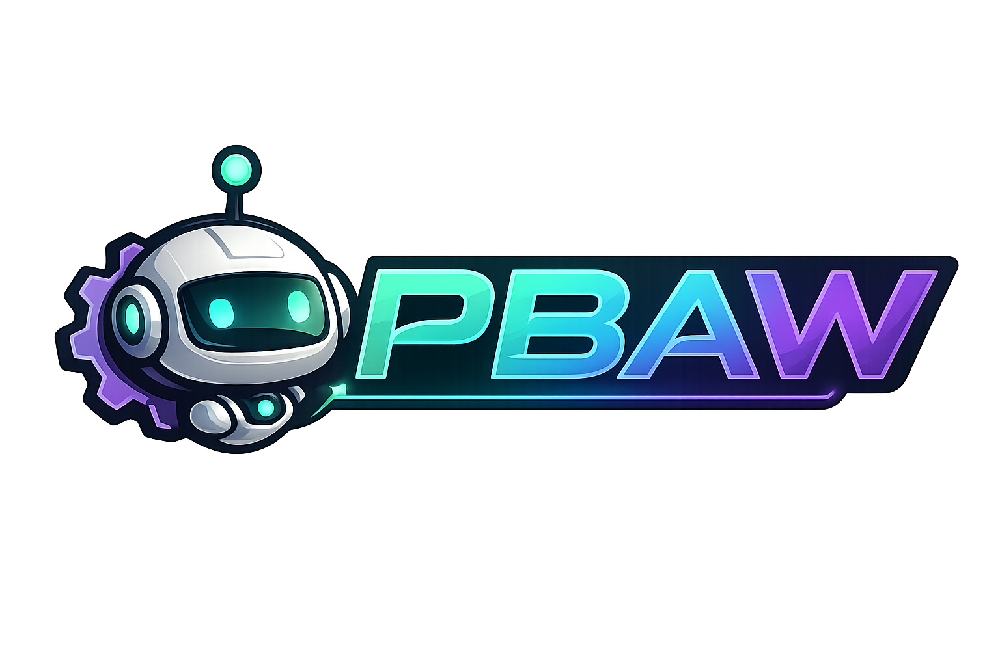

<p align="center">
  
</p>

<div align="center">
  <a href="https://buymeacoffee.com/mvagnon">
    
  </a>
</div>

---

# Plan-Based Agentic Workflow

Agent Skills for a decision-to-delivery workflow with short skills, Plan Mode-friendly user decisions, and technical references kept out of the main skill body.

PBAW treats the user as the product and architecture authority, and as an experienced software engineer/architect. Questions and proposed plans should stay technical at that level, with priority on UX and database/data-model decisions; other questions should stay focused on blockers.

## Skills

- `brainstorm`: ask targeted questions, analyze the repository with Serena MCP, then research with Exa, Context7, and `gh` CLI (+ Repomix) to resolve complex technical decisions before PM planning or direct implementation.
- `feed-pm`: analyze the repository with Serena MCP, propose a Technical Roadmap with task previews, revise it when challenged, create execution-ready PM tasks after explicit approval, then recap.
- `implement-pm`: requires PM system name and exact task IDs, runs the branch script first, retrieves PM tasks, and focuses only on implementation.
- `create-pr`: create draft PRs from `{pm-tool}/{task-ids}` branches, attach PM task URLs, backlink PRs to tasks, then run `review-pr`.
- `review-pr`: perform a strict production-readiness review with mandatory full local CI.
- `fix-pr`: propose a PR remediation plan, revise it when challenged, then apply fixes after explicit approval.

## Prerequisites

Required:

- **Git**, for obvious reasons.
- **A coding agent** that supports skills and, ideally, plan mode.
- **Exa MCP** for additional technical context.
- **Context7 MCP** for official dependency and framework documentation, in addition to Exa.
- **gh CLI** for GitHub PRs, issues, and external repository queries.
- **Repomix MCP** to gather context from actual GitHub repositories.
- **Serena MCP** for accurate codebase analysis in PM planning, implementation, PR review, and PR remediation.

Good to have:

- Any PM tool MCP or CLI if needed.
- `mermaid-diagrams` skill:

```bash
npx skills add https://github.com/softaworks/agent-toolkit --skill mermaid-diagrams
```

## Installation

Install this workflow:

```bash
npx skills add mvagnon/plan-based-agentic-workflow --skill '*'
```

Expected layout:

```text
plan-based-agentic-workflow/
|-- .claude-plugin/
|   `-- plugin.json
|-- README.md
|-- scripts/
|   |-- validate-skills.py
|   `-- validate-skills.sh
`-- skills/
    |-- brainstorm/
    |   |-- SKILL.md
    |   `-- references/
    |-- feed-pm/
    |   |-- SKILL.md
    |   `-- references/
    |-- implement-pm/
    |   |-- SKILL.md
    |   |-- references/
    |   `-- scripts/
    |       `-- create-pm-branch.sh
    |-- create-pr/
    |   |-- SKILL.md
    |   `-- references/
    |-- review-pr/
    |   |-- SKILL.md
    |   `-- references/
    `-- fix-pr/
        |-- SKILL.md
        `-- references/
```

## Workflow

Use this framework as a decision-to-delivery path:

1. Brainstorm the approach with `brainstorm` in **plan mode**.
2. Create the plan and add the PM tasks with `feed-pm` in **plan mode**.
3. Implement the plan in a specific git branch with `implement-pm`.
4. Create and review the PR with `create-pr`.
5. Fix the PR by implementing the previous step's recommendations with `fix-pr` in **plan mode**.
6. Review the PR again with `review-pr`; repeat `fix-pr` and `review-pr` until the PR is `PROD READY`.

You can also skip PM-task creation when you want to implement faster:

1. Brainstorm with `brainstorm` or plan the integration with `feed-pm`, in **plan mode**.
2. Proceed directly with implementation from the approved plan.
3. Create and review the PR with `create-pr`.
4. Fix and re-review until the PR is `PROD READY`.

## Validation

After editing skills, validate the skill shape and local references:

```bash
scripts/validate-skills.sh
```

The validator checks frontmatter descriptions, required `SKILL.md` headings, Mermaid diagrams, fenced code blocks, and local files referenced from each `## References` section.

## Test Authoring Strategy

PBAW skills do not create new tests by default. This is intentional: tests written during small implementation tasks tend to target microscopic features and can create too many false positives.

When tests are needed, write them through the dedicated journey-test skill instead:

```bash
npx skills add mvagnon/skills --skill write-tests
```

That workflow favors tests for user journeys and product flows rather than fragile tests around narrow implementation details.

## Safety Rules

- `brainstorm` can ask targeted clarification questions. It does not write code, create PM tasks, open PRs, or mutate external systems.
- `feed-pm` proposes a complete Technical Roadmap first, preserves it when challenged, and creates execution-ready PM tasks only after explicit approval.
- `feed-pm` can proceed directly with implementation only through `references/direct-implementation.md`, with explicit `direct/<scope-slug>` branch arguments and without invoking `implement-pm`.
- `implement-pm` must run the branch script before PM retrieval, Serena analysis, or edits.
- The branch script creates or switches to the target branch and pushes it immediately. It does not stash, reset, or clean local work; inspect the worktree first when unrelated local changes matter.
- `create-pr` creates draft PRs and PM backlinks, then runs `review-pr`.
- `review-pr` does not implement fixes and cannot merge or close PM tasks without passing local CI and explicit approval.
- `fix-pr` does not merge, mark PRs ready, close PM tasks, or update PM status.
- No skill should add dependencies, logs, broad refactors, or new tests by default.

## Technical References

References are bundled per skill and contain commands, templates, research mechanics, and PM/Git mechanics only. The main `SKILL.md` files define the human workflow and expected response format.

Repository-level authoring rules live in `AGENTS.md`.
