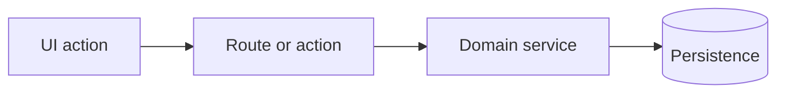

# Task Specification

Tasks should be easy for a senior engineer to review and complete enough for an implementation agent to execute without re-planning the feature from scratch.

## Size Rubric

Aim for tasks with comparable review weight:

- One coherent behavior, contract, or infrastructure step per task.
- Review should usually fit in a focused PR review session, roughly 20-45 minutes for a senior engineer.
- The implementation should fit in one branch/worktree without unrelated refactors.
- A task can touch several files when it is a vertical slice, but avoid combining unrelated risks.

Split tasks when they mix:

- migration plus UI;
- public API contract plus unrelated visual changes;
- permission model plus convenience refactor;
- shared foundation plus dependent feature work;
- multiple independent user journeys.

Merge tasks when they are too small to review independently:

- a type and its only consumer;
- a hook and a tiny UI caller;
- a schema field and the single service branch that owns it.

## Required Issue Body Template

Use this structure for every PM task. Keep the digest concise, then put deeper implementation detail below it.

```markdown
## Digest

**Outcome:** <one sentence describing the user/developer-visible result>

**Scope:** <what is included>

**Non-goals:** <what must not be changed in this task>

**Implementation anchors:** <short list of key files/symbols/patterns to reuse>

**Acceptance criteria:**
- [ ] <observable criterion>
- [ ] <observable criterion>
- [ ] <relevant failure/edge criterion>

## Context

<Why this task exists, what upstream task/product goal it supports, and important constraints discovered in the repo.>

## Technical Plan

1. <implementation step>
2. <implementation step>
3. <implementation step>

## Contracts And Data

<DTOs, schemas, API shapes, query keys, state transitions, permissions, migrations, or event contracts. Omit if not applicable.>

## Dependencies

- Depends on: <issue numbers or "none">
- Unblocks: <issue numbers or "unknown until creation">

## Verification

<Relevant existing commands/checks and manual review points. Do not require new tests unless the task or project explicitly requires them.>

## Reviewer Notes

<Risk areas, compatibility constraints, rollback notes, or what deserves careful human review.>
```

## Optional Diagrams

Use one compact Mermaid diagram only when it makes sequencing, data flow, or entity relationships clearer. Keep it small enough to be reviewed in the issue body.



Good diagram targets:

- state machine changes;
- request/response flow;
- data ownership boundaries;
- dependency order across tasks.

Avoid diagrams for obvious one-step edits.

## Decomposition Checklist

Before proposing tasks, verify:

- Each task has one primary owner area.
- Dependencies are explicit and acyclic.
- Shared business logic appears in one task and one eventual code location.
- Existing validations, DTOs, types, design-system primitives, hooks, services, and repositories are reused or extended.
- The issue title is action-oriented and scoped, for example `Add server-side workspace role validation`.
- The digest can be understood in under one minute.
- The detailed section contains enough anchors for implementation.
- Acceptance criteria are observable and not tied to private implementation details.

## Title Format

Prefer:

```text
<verb> <scoped technical outcome>
```

Examples:

- `Add billing plan entitlement validation`
- `Persist invite acceptance audit events`
- `Wire project filters through URL state`
- `Migrate task status enum to explicit workflow states`

Avoid vague titles like `Improve dashboard` or `Refactor auth`.
