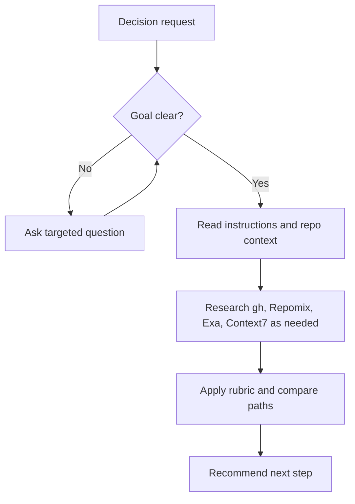

# Brainstorm

## Summary

Compare integration strategies before planning PM tasks or writing code.

Use this skill to produce a repository-grounded recommendation with:

- one handmade in-house approach;
- one external dependency approach when a credible dependency exists;
- one recommendation with assumptions, risks, and next step.

Treat lines of code as future maintenance cost. Prefer approaches with the fewest added lines after accounting for deleted lines. When a small concession in scope, polish, generality, or configurability can reduce the diff by hundreds of added lines without violating the user's core goal, security, or documented architecture, present it as a user decision to approve.

This skill does not write code, create PM tasks, open PRs, or mutate external systems.

## Diagram



## Inputs

Gather the following inputs using the user's prompt.

- feature, integration, bug, refactor, or technical decision to explore (blocking)
- preferred approach (optional, default to _both_):
  - handmade
  - external dependency
- line budget, acceptable concessions, or non-negotiable behavior (optional; concessions still need explicit user approval when they change behavior or scope)

Also, while working, ask for as many questions as you need with a clear goal in mind: give a precise, efficient answer.

## References

Load only the references needed for the current decision:

- `references/repo-analysis.md` for repository and Serena evidence collection.
- `references/external-research.md` for Exa, Context7, and gh CLI research commands.
- `references/recommendation-rubric.md` before writing the final comparison and recommendation.

## Workflow

### Repository Analysis

Read governing global and project-specific instruction files before analyzing implementation details:

- `AGENTS.md`
- `CLAUDE.md`
- `GEMINI.md`
- relevant `README.md` files

Use Serena when available before external research to identify the actual repository context:

- current implementation surface and likely owner folders;
- existing modules, services, hooks, components, schemas, validators, clients, routes, commands, integrations, or reusable primitives;
- architecture constraints declared in instruction files;
- data model, security, deployment, runtime, and dependency constraints;
- existing dependency choices and package boundaries;
- check commands relevant to the explored area.

Use code to understand current implementation and reuse opportunities. Do not invent architecture from code when governing instructions do not define it; state the gap as a recommendation risk instead.

### External Research Order

After repository analysis, search for useful external resources:

1. **Use gh CLI first.**

Discover projects that could match the request:

```bash
gh search repos "Search content" --sort stars --order desc --limit 20 --language "searched-language"
```

Use the following command to understand a repository by reading its `README.md`:

```bash
gh repo view owner/repo
```

Then, if the user is interested in the handmade approach, understand implementation patterns using Repomix MCP's `pack_remote_repository`, `read_repomix_output`, and `grep_repomix_output` tools.

2. **Use `Exa` MCP to enrich gathered information and search implementation practices through the web (forums, etc.).**

Exemple: `How to implement x in y with z`.

3. **Finally, use Context7 to verify official docs for frameworks, SDKs, APIs, and candidate dependencies.**

If the user only asked for the handmade approach and official framework or dependency docs would not change the decision, skip this step.

### Handmade Approach

Describe the in-house approach in the repository's vocabulary.

Include:

- likely implementation path;
- existing code to reuse or extend;
- expected files, modules, or owner folders touched;
- expected added/deleted line impact and any small concessions that could keep the implementation compact if the user approves them;
- data model and API impact;
- security and authorization implications;
- operational and maintenance cost;
- verification strategy;
- risks.

### External Dependency Approach

Describe the dependency-based approach only when a credible option exists.

Include:

- dependency name and source;
- why it fits the requested integration;
- integration path in this repository;
- API fit with existing code;
- expected glue-code additions/deletions and whether the dependency avoids a larger handmade diff;
- maintenance, license, and release signals;
- bundle, runtime, deployment, or operational impact;
- security and supply-chain implications;
- lock-in, migration, and fallback risks.

If no credible dependency exists, say so directly and compare the handmade approach against that absence.

### Recommendation

Recommend one path.

Base the recommendation on:

- user intent from the request;
- repository constraints found with Serena;
- Exa research;
- Context7 official docs;
- GitHub repository evidence from `gh`;
- the rubric in `references/recommendation-rubric.md`.
- the smallest coherent diff, including concessions that could reduce implementation lines if the user approves them.

End with three next-step options only:

- implement the recommended solution directly;
- invoke `feed-pm` with the recommended strategy when the user accepts the recommendation;
- challenge the strategy when the user wants to change assumptions, tradeoffs, constraints, or the chosen direction.

## Expected Response Format

Adapt depending on user's preferred approach (handmade, external dependency or both).

```markdown
## Brainstorm Recommendation

Summary: <one-paragraph recommendation>

Context checked:
- Repo: <key constraints and reuse opportunities>
- Research: <gh/Repomix/Exa/Context7 sources used or skipped>

Approaches:
- Handmade: <path, line impact, security/data/API impact, risks>
- Dependency: <credible option and integration impact, or why none fits>

Comparison: <fit, complexity, maintenance, net additions, security, lock-in, time to ship>

Recommendation: <chosen path and why>
Confidence: <low | medium | high>
What would change this: <evidence>
Concessions to approve: <small diff-saving concession or "None">
Next: <Implement directly | Invoke `feed-pm` | Challenge the strategy>
```
