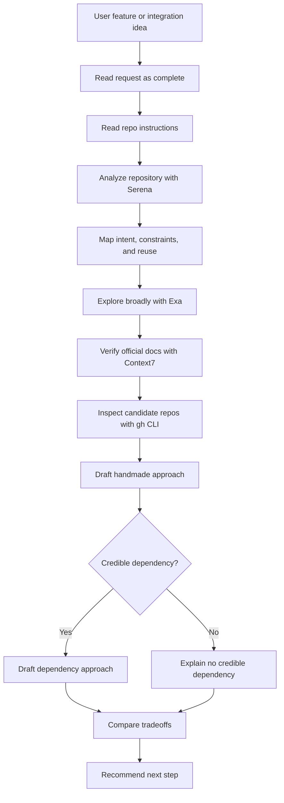

# Brainstorm

## Summary

Compare integration strategies before planning PM tasks or writing code.

Use this skill to produce a repository-grounded recommendation with:

- one handmade in-house approach;
- one external dependency approach when a credible dependency exists;
- one recommendation with assumptions, risks, and next step.

Treat the user's request as exhaustive. Do not ask clarification questions and do not recommend Plan Mode. If evidence is incomplete but the request is safe and actionable, state the assumption or risk and continue.

This skill does not write code, create PM tasks, open PRs, or mutate external systems.

## Diagram



## Workflow

### Inputs

Read the user message as the complete feature, integration, bug, refactor, or technical decision to explore.

Do not pause for product clarification, architecture clarification, PM target selection, or Plan Mode. When a choice is not discoverable, continue with an explicit assumption and mark the recommendation confidence accordingly.

Stop only when:

- Serena is unavailable, because repository-grounded brainstorming requires local code intelligence;
- the request is unsafe or asks for unauthorized access, credential exposure, or harmful behavior;
- the repository cannot be read.

### References

Load only the references needed for the current decision:

- `references/repo-analysis.md` for repository and Serena evidence collection.
- `references/external-research.md` for Exa, Context7, and gh CLI research commands.
- `references/recommendation-rubric.md` before writing the final comparison and recommendation.

### Repository Analysis

Read governing global and project-specific instruction files before analyzing implementation details:

- `AGENTS.md`
- `CLAUDE.md`
- `GEMINI.md`
- relevant `README.md` files

Use Serena before external research to identify the actual repository context:

- current implementation surface and likely owner folders;
- existing modules, services, hooks, components, schemas, validators, clients, routes, commands, integrations, or reusable primitives;
- architecture constraints declared in instruction files;
- data model, security, deployment, runtime, and dependency constraints;
- existing dependency choices and package boundaries;
- check commands relevant to the explored area.

Use code to understand current implementation and reuse opportunities. Do not invent architecture from code when governing instructions do not define it; state the gap as a recommendation risk instead.

### External Research Order

After repository analysis, research from broad to precise:

1. Use Exa first to discover current approaches, alternatives, implementation patterns, and risk areas.
2. Use Context7 next to verify official docs for frameworks, SDKs, APIs, and candidate dependencies.
3. Use `gh` CLI last to inspect concrete GitHub repositories, release activity, maintenance signals, issues, license, and API fit.

Prefer primary sources. Use secondary sources to discover alternatives or compare tradeoffs, not as the final authority.

### Handmade Approach

Describe the in-house approach in the repository's vocabulary.

Include:

- likely implementation path;
- existing code to reuse or extend;
- expected files, modules, or owner folders touched;
- data model and API impact;
- security and authorization implications;
- operational and maintenance cost;
- verification strategy;
- risks.

### External Dependency Approach

Describe the dependency-based approach only when a credible option exists.

Include:

- dependency name and source;
- why it fits the requested integration;
- integration path in this repository;
- API fit with existing code;
- maintenance, license, and release signals;
- bundle, runtime, deployment, or operational impact;
- security and supply-chain implications;
- lock-in, migration, and fallback risks.

If no credible dependency exists, say so directly and compare the handmade approach against that absence.

### Recommendation

Recommend one path.

Base the recommendation on:

- user intent from the request;
- repository constraints found with Serena;
- Exa research;
- Context7 official docs;
- GitHub repository evidence from `gh`;
- the rubric in `references/recommendation-rubric.md`.

End with two next-step options only:

- invoke `feed-pm` with the recommended strategy when the user accepts the recommendation;
- challenge the strategy when the user wants to change assumptions, tradeoffs, constraints, or the chosen direction.

## Expected Response Format

### Final Response

```markdown
## Brainstorm Recommendation

Summary:
<one-paragraph recommendation>

User intent:
<what the user wants, interpreted from the exhaustive request>

Repository context:
- <Serena/repo finding>
- <constraint or reuse opportunity>

Research checked:
- Exa: <topics or sources checked>
- Context7: <official docs checked>
- GitHub: <repos/packages checked with gh CLI>

## Approach 1: Handmade

<concrete in-house approach>

Pros:
- <point>

Cons:
- <point>

Risks:
- <point>

## Approach 2: External Dependency

<dependency approach, or why no credible dependency exists>

Pros:
- <point>

Cons:
- <point>

Risks:
- <point>

## Comparison

| Criterion | Handmade | External dependency |
|---|---|---|
| Fit with repo | <assessment> | <assessment> |
| Complexity | <assessment> | <assessment> |
| Maintenance | <assessment> | <assessment> |
| Security | <assessment> | <assessment> |
| Lock-in | <assessment> | <assessment> |
| Time to ship | <assessment> | <assessment> |

## Recommendation

<chosen path and why>

Confidence:
<low | medium | high>

What would change this:
- <evidence that would change the recommendation>

Next steps:
- Invoke `feed-pm`: <suggested feed-pm request using the recommended strategy>
- Challenge the strategy: <specific angle the user could challenge, such as assumptions, dependency choice, risk tolerance, or scope>
```

## Checklist

- [ ] User request treated as complete.
- [ ] No clarification question or Plan Mode recommendation introduced.
- [ ] Governing instruction files read.
- [ ] Serena used before external research.
- [ ] Existing reuse opportunities and constraints identified.
- [ ] Architecture gaps stated as risks instead of guessed.
- [ ] Exa used first for broad current research.
- [ ] Context7 used second for official docs.
- [ ] `gh` CLI used third for GitHub repository evidence.
- [ ] Handmade approach proposed.
- [ ] External dependency approach proposed or absence justified.
- [ ] Recommendation includes assumptions, risks, confidence, and exactly two next-step options: invoke `feed-pm` or challenge the strategy.
- [ ] No code, PM task, PR, or external mutation performed.
