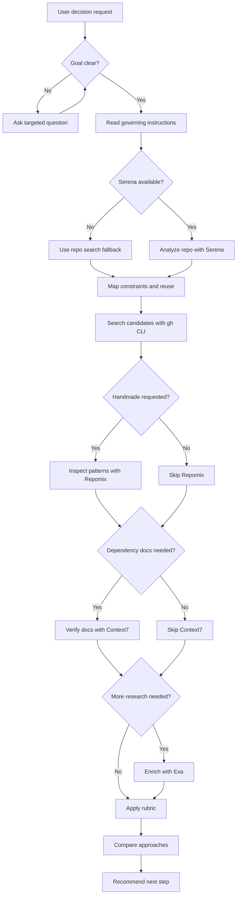

# Brainstorm

## Summary

Compare integration strategies before planning PM tasks or writing code.

Use this skill to produce a repository-grounded recommendation with:

- one handmade in-house approach;
- one external dependency approach when a credible dependency exists;
- one recommendation with assumptions, risks, and next step.

This skill does not write code, create PM tasks, open PRs, or mutate external systems.

## Diagram



## Inputs

Gather the following inputs using user's prompt.

- feature, integration, bug, refactor, or technical decision to explore (blocking)
- preferred approach (optional, default to _both_):
  - handmade
  - external dependency

Also, while working, ask for as many questions as you need with a clear goal in mind: give a precise, efficient answer.

## References

Load only the references needed for the current decision:

- `references/repo-analysis.md` for repository and Serena evidence collection.
- `references/external-research.md` for Exa, Context7, and gh CLI research commands.
- `references/recommendation-rubric.md` before writing the final comparison and recommendation.

## Workflow

### Repository Analysis

Read governing global and project-specific instruction files before analyzing implementation details:

- `AGENTS.md`
- `CLAUDE.md`
- `GEMINI.md`
- relevant `README.md` files

Use Serena when available before external research to identify the actual repository context:

- current implementation surface and likely owner folders;
- existing modules, services, hooks, components, schemas, validators, clients, routes, commands, integrations, or reusable primitives;
- architecture constraints declared in instruction files;
- data model, security, deployment, runtime, and dependency constraints;
- existing dependency choices and package boundaries;
- check commands relevant to the explored area.

Use code to understand current implementation and reuse opportunities. Do not invent architecture from code when governing instructions do not define it; state the gap as a recommendation risk instead.

### External Research Order

After repository analysis, search for useful external resources:

1. **Use gh CLI first.**

Discover projects that could match the request:

```bash
gh search repos --language "searched-language" --topic "searched-topic"
```

Use the following command to understand a repository by reading its `README.md`:

```bash
gh repo view owner/repo
```

Then, if user's is interested in the handmade approach, understand implementation patterns using `Repomix` MCP's `pack_remote_repository`, `read_repomix_output` and `grep_repomix_output` tools.

2. **Use Context7 to verify official docs for frameworks, SDKs, APIs, and candidate dependencies.**

I the user is asking for the handmade approach, skip this step.

3. Finally, use `Exa` MCP to enrich the gathered information if needed.

### Handmade Approach

Describe the in-house approach in the repository's vocabulary.

Include:

- likely implementation path;
- existing code to reuse or extend;
- expected files, modules, or owner folders touched;
- data model and API impact;
- security and authorization implications;
- operational and maintenance cost;
- verification strategy;
- risks.

### External Dependency Approach

Describe the dependency-based approach only when a credible option exists.

Include:

- dependency name and source;
- why it fits the requested integration;
- integration path in this repository;
- API fit with existing code;
- maintenance, license, and release signals;
- bundle, runtime, deployment, or operational impact;
- security and supply-chain implications;
- lock-in, migration, and fallback risks.

If no credible dependency exists, say so directly and compare the handmade approach against that absence.

### Recommendation

Recommend one path.

Base the recommendation on:

- user intent from the request;
- repository constraints found with Serena;
- Exa research;
- Context7 official docs;
- GitHub repository evidence from `gh`;
- the rubric in `references/recommendation-rubric.md`.

End with two next-step options only:

- invoke `feed-pm` with the recommended strategy when the user accepts the recommendation;
- challenge the strategy when the user wants to change assumptions, tradeoffs, constraints, or the chosen direction.

## Expected Response Format

Adapt depending on user's preferred approach (handmade, external dependency or both).

```markdown
## Brainstorm Recommendation

Summary:
<one-paragraph recommendation>

User intent:
<what the user wants, interpreted from the exhaustive request>

Repository context:

- <Serena/repo finding>
- <constraint or reuse opportunity>

Research checked:

- Exa: <topics or sources checked>
- Context7: <official docs checked>
- GitHub: <repos/packages checked with gh CLI>

## Approach 1: Handmade

<concrete in-house approach>

Pros:

- <point>

Cons:

- <point>

Risks:

- <point>

## Approach 2: External Dependency

<dependency approach, or why no credible dependency exists>

Pros:

- <point>

Cons:

- <point>

Risks:

- <point>

## Comparison

| Criterion     | Handmade     | External dependency |
| ------------- | ------------ | ------------------- |
| Fit with repo | <assessment> | <assessment>        |
| Complexity    | <assessment> | <assessment>        |
| Maintenance   | <assessment> | <assessment>        |
| Security      | <assessment> | <assessment>        |
| Lock-in       | <assessment> | <assessment>        |
| Time to ship  | <assessment> | <assessment>        |

## Recommendation

<chosen path and why>

Confidence:
<low | medium | high>

What would change this:

- <evidence that would change the recommendation>

Next steps:

- Directly proceed to implementation
- Invoke `feed-pm`: <suggested feed-pm request using the recommended strategy>
- Challenge the strategy: <specific angle the user could challenge, such as assumptions, dependency choice, risk tolerance, or scope>
```
