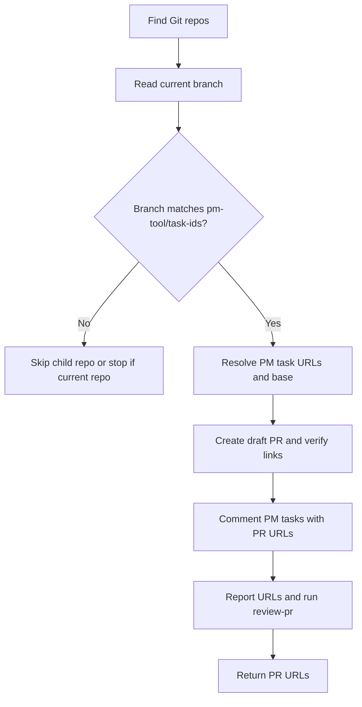

# Create PR

## Summary

Create draft PRs from implementation branches.

The branch name is the source of truth:

```text
<pm-tool>/<task-ids>
```

The PR body stays minimal because the PM tasks carry the full specification. After creating and verifying PRs, add a PR URL comment to each linked PM task, report every created PR URL to the user, then run `review-pr` and repeat the URL set in the final response.

## Diagram



## Inputs

No argument is required by default. Resolve the PM tool and task IDs from each repository branch.

Optional overrides:

- `repository`: current repo or child repo path.
- `base`: PR base branch when local branch metadata is missing or wrong.

## References

Load only what is needed:

- `references/pr-task-links.md` for Git/GitHub PR commands and PM task URL resolution.

## Workflow

### Repository Selection

Use the current Git repository first. If the current directory is a workspace with child Git repositories, include child repositories only when their current branch also matches `<pm-tool>/<task-ids>`.

Do not create branches from this skill. Branches belong to `implement-pm`.

### PR Creation

For each selected repository:

1. Parse `pm-tool` and `task-ids` from the current branch.
2. Resolve every PM task to a stable URL.
3. Read `branch.<branch>.pbaw-base` from local Git config. If missing, use the repository default branch unless the user provided `base`.
4. Create a draft PR and capture its URL.
5. Put PM task URLs at the top of the PR body.
6. Re-read the PR and verify the body contains every required PM task URL or supported GitHub closing keyword.
7. After all repository PR URLs for this `create-pr` run are known, add one comment to each linked PM task containing the relevant PR URL set.
8. Verify each PM task comment was posted or visible when the provider supports read-back.
9. Report every created PR URL to the user.
10. Keep every created PR URL for the final response.
11. Immediately run `review-pr` for the created PR set.

### Rules

- Keep PR title and body short.
- Do not copy full task bodies into the PR.
- Do not invent expected outcomes, validation plans, labels, or PM statuses.
- For GitHub Issues, use one closing keyword per issue when the PR base supports native linking.
- Write back to PM tasks only by adding a comment that lists the created PR URL set. Do not write fields, relations, description changes, or status changes back to PM tasks.
- For non-GitHub PM tasks, verify every task URL is present in the PR body and the PR URL comment was posted.
- Always report every created PR URL before `review-pr`, then return the same URL set in the final response, including when `review-pr` blocks or fails. For multi-repository PR sets, list one URL per repository.
- Do not mark tasks done.
- Do not merge.
- Stop before `review-pr` if any required task URL cannot be resolved, cannot be verified in the PR body, or cannot receive the required PR URL comment.

## Expected Response Format

### Response

Return this only after `review-pr` finishes or if PR creation or task-link verification is blocked.

```markdown
## Create PR

Created PR URLs:

- <repo path>: <draft PR URL>

PM tasks:

- <task id/title>: <task URL> - PR body link <verified|blocked>, PM comment <posted|blocked>

Review PR URLs:

- <repo path>: <PR URL>
```
