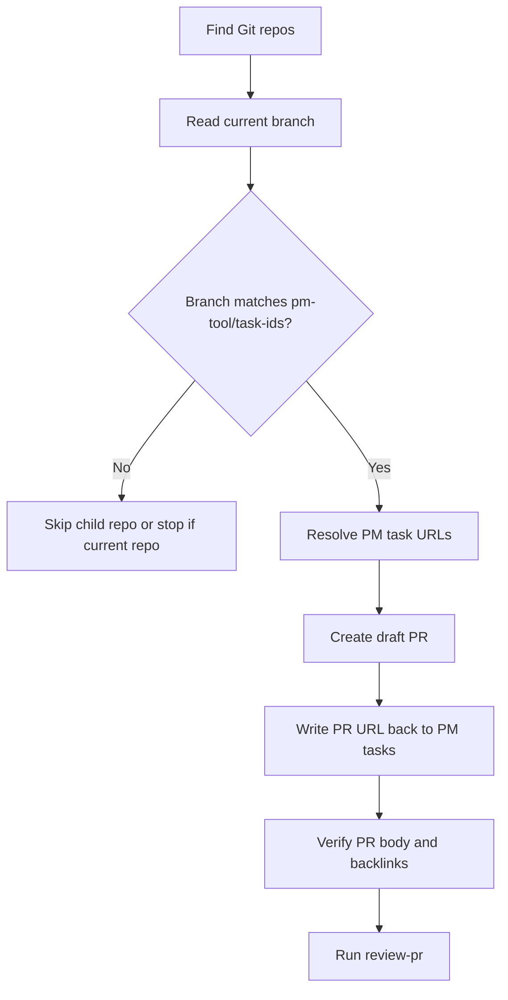

# Create PR

## Summary

Create draft PRs from implementation branches.

The branch name is the source of truth:

```text
<pm-tool>/<task-ids>
```

The PR body stays minimal because the PM tasks carry the full specification. After creating and backlinking PRs, immediately run `review-pr`.

## Diagram



## Workflow

### Inputs

No argument is required by default. Resolve the PM tool and task IDs from each repository branch.

Optional overrides:

- `repository`: current repo or child repo path.
- `base`: PR base branch when local branch metadata is missing or wrong.

### References

Load only what is needed:

- `references/pr-and-backlinks.md` for Git/GitHub PR commands, PM task URL resolution, and backlink updates.

### Repository Selection

Use the current Git repository first. If the current directory is a workspace with child Git repositories, include child repositories only when their current branch also matches `<pm-tool>/<task-ids>`.

Do not create branches from this skill. Branches belong to `implement-pm`.

### PR Creation

For each selected repository:

1. Parse `pm-tool` and `task-ids` from the current branch.
2. Resolve every PM task to a stable URL.
3. Read `branch.<branch>.pbaw-base` from local Git config. If missing, use the repository default branch unless the user provided `base`.
4. Create a draft PR.
5. Put PM task URLs at the top of the PR body.
6. Write the PR URL back to each PM task through a dedicated PR field, relation, comment, or description fallback.
7. Re-read enough state to verify the PR body and PM backlinks.
8. Immediately run `review-pr` for the created PR set.

### Rules

- Keep PR title and body short.
- Do not copy full task bodies into the PR.
- Do not invent expected outcomes, validation plans, labels, or PM statuses.
- For GitHub Issues, use one closing keyword per issue when the PR base supports native linking.
- For non-GitHub PM tasks, verify every PR URL after backlinking, especially when one task spans several repositories.
- Do not mark tasks done.
- Do not merge.
- Stop before `review-pr` if any required task URL or PR backlink cannot be verified.

## Expected Response Format

### Final Response

Return this only after `review-pr` finishes or if PR creation/backlinking is blocked.

```markdown
## Create PR

Created:
- <repo path>: <draft PR URL>

PM tasks:
- <task id/title>: <task URL> - backlink <verified|blocked>

Review:
- <review-pr verdict or blocker>

Next:
<exact next step>
```

## Checklist

- [ ] Repository set resolved from current repo and matching child repo branches.
- [ ] Branch names parsed as `<pm-tool>/<task-ids>`.
- [ ] PM task URLs resolved.
- [ ] Draft PRs created with minimal PM task links in the body.
- [ ] PR URLs written back to PM tasks.
- [ ] PR body and backlinks verified.
- [ ] `review-pr` run immediately after successful PR creation.
