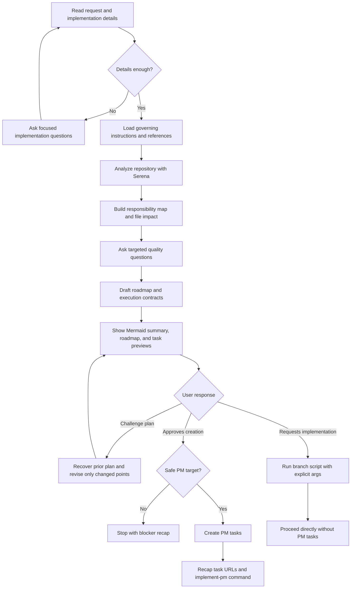

# Feed PM

## Summary

Turn one product or engineering request into a repository-grounded Technical Roadmap and execution-ready PM tasks.

The input must include the requested outcome and a few implementation details. If those details are missing or too vague, ask for them before drafting tasks.

Plan Mode is recommended because it gives the model room to explore the repository, ask targeted questions, preserve context, review the Technical Roadmap, and revise the task split before mutating the PM system.

Always ask focused questions while preparing the plan. Use questions to improve project fit, implementation precision, data model/API choices, UX behavior, security posture, PM targeting, and blocker handling.

Never create PM tasks before explicit user approval of the proposed plan.

Do not plan new tests, new test files, or test-writing tasks unless the user explicitly requested tests. Verification should use existing checks or review points by default.

Treat lines of code as future maintenance cost. Prefer the smallest coherent diff, especially the fewest added lines after accounting for deleted lines. Propose small implementation or product concessions when they can remove hundreds of added lines without violating the requested outcome, security, or documented architecture, but wait for user approval before relying on those concessions.

Treat the user as the product and architecture authority, and as an experienced software engineer/architect.

## Diagram



## Inputs

Read the explicit invocation or user message as:

- `task_request`: required product request, feature scope, bug, refactor, or backlog idea.
- `implementation_details`: required useful implementation context. Accept any mix of desired behavior, target UX, affected surface, data model/API notes, existing files or modules to reuse, constraints, non-goals, rollout needs, security concerns, or preferred implementation direction.
- `pm_tool`: optional, for example `github`, `jira`, `notion`, or another installed PM MCP/CLI.
- `project_id`: optional repository, board, project, database, or PM target.

If `task_request` is missing, stop and ask for it.

If `implementation_details` are missing or too generic to produce implementation-ready tasks, ask focused technical questions before drafting the plan. Keep the questions few and high leverage.

If `pm_tool` or `project_id` are missing or unclear, fall back to GitHub Issues on the repository or repositories concerned by the request when the remotes, `gh` authentication, and issue settings make that safe. If the PM target cannot be resolved safely, ask for the missing PM target detail before creation.

Preserve the language used by the user to describe the requested work for PM task titles, task bodies, proposed plans, and final recaps. Keep code identifiers, paths, commands, API names, and product terms literal.

## References

Load only the references needed for the current PM tool and request:

- `references/architecture-rules.md` before task decomposition.
- `references/codebase-analysis.md` for Serena exploration.
- `references/task-specification.md` for execution-ready PM task bodies.
- `references/pm-tools.md` for PM discovery and item creation commands.
- `references/direct-implementation.md` when direct implementation is selected.
- `mermaid-diagrams` skill only for one compact Mermaid summary in the pre-approval Technical Roadmap.

## Workflow

### Prepare

Load and respect all governing global and project-specific `AGENTS.md`, `CLAUDE.md`, and `GEMINI.md` files. Treat them as authoritative repository instructions; if they conflict, surface the conflict instead of silently choosing.

Load relevant architecture, design, security, framework, and provider resources before decomposing tasks when the request touches those areas.

Recommend Plan Mode when the runner supports it. Use the runner-native question or clarification tool when available; otherwise ask directly in chat.

### Analyze The Project

Use Serena before drafting tasks. If Serena is unavailable, stop instead of creating implementation-ready tasks from local search alone.

Load and apply `references/architecture-rules.md` before task decomposition. Use it to identify ownership, reuse, duplication, validation, typing, design-system, data, backend, frontend, security, and task-boundary concerns.

Discover repository facts before final questions: files, ownership, schemas, routes, services, components, validators, conventions, check commands, and PM target signals.

Correlate the plan tightly to the project. Each task should name the owner area and expected new, modified, and deleted files using exact paths when discoverable and owner folders otherwise. If the project lacks enough architecture direction to plan safely, ask the user for the missing architecture decision instead of inventing it from the codebase.

Do not write local planning Markdown.

### Ask Quality Questions

Always ask at least one focused question set during planning, after initial repository exploration and before finalizing the proposed plan.

Prioritize questions that materially improve the task plan:

- UX behavior and user journeys;
- database tables, migrations, schema ownership, or data model changes;
- API contracts, validation, permissions, auth, and security boundaries;
- concrete implementation details, non-goals, rollout, and compatibility constraints;
- PM target, dependency order, or blockers that cannot be discovered from the repository.

Do not add repeated approval loops. Ask the focused question set, ask follow-up questions only for blockers, then present the complete plan for approval or challenge.

### Build The Roadmap And Task Contracts

Treat duplication as a primary decomposition concern. Detect duplicated code and near-duplicate code that should be standardized, such as two close React components that should become one component with variants.

Minimize net new implementation lines, not just task count. Prefer reusing, deleting, or extending existing owners over creating new abstractions. When a small concession in polish, generality, configuration, or optional behavior could remove many added lines, surface that concession for explicit user approval before making it part of the plan.

Do not force tasks to have equal size. Uneven tasks are correct when engineering boundaries are uneven.

Separate frontend, backend, and devops work into distinct PM tasks whenever the request touches more than one of those surfaces. Omit a surface only when it has no real implementation work.

Keep shared contracts, schemas, tokens, or foundations in their own task only when they are reused by several surfaces; do not hide frontend, backend, or devops implementation inside that shared task.

Do not create duplicate tasks for the same business rule, validator, component, or workflow.

Do not invent labels, statuses, assignees, milestones, project fields, or PM schema values.

Before asking for approval, present a Technical Roadmap for the whole task set. It must include one compact Mermaid diagram at the top as the roadmap summary, then prose sections for implementation sequence, ownership boundaries, data/API/interface impact, risks, concessions requiring approval, and verification strategy.

Use `mermaid-diagrams` only for the pre-approval roadmap summary. Do not require Mermaid inside generated PM task bodies.

After the roadmap, show task previews. Each preview should summarize the execution contract that will be created in the PM item: implementation objective, owner and reuse path, expected file impact, interfaces/data flow, implementation steps, edge cases, external dependencies, acceptance criteria, verification, and task dependencies.

Do not include new tests, test files, test tasks, or test-writing acceptance criteria unless the user explicitly requested tests. Verification should reference existing lint, typecheck, test, build, or review commands when they already exist.

### Revise A Challenged Plan

When the user challenges the proposed plan:

1. Recover the previous proposed plan from the conversation before revising.
2. Preserve every plan detail that the user did not ask to change.
3. Adjust only the challenged scope, assumptions, task split, wording, dependencies, or PM target.
4. Return a complete replacement proposed plan, not a partial diff.

If the previous plan is no longer available in context, ask the user to provide or confirm the missing plan details before regenerating. This prevents accidental task loss.

### Create Tasks Or Implement Directly

After explicit user approval:

1. Reconfirm the approved plan in memory before mutating the PM system.
2. Create one PM item per task in dependency order.
3. Include task dependencies using native PM relationships when safely available; otherwise include dependency URLs in the task body.
4. Create each PM item as an execution contract using `references/task-specification.md`; the task body must be precise enough for an LLM to implement without re-planning the whole roadmap.
5. Return a short recap with task URLs and the next `implement-pm` request details.

If the user refuses creation, challenges the plan, changes the scope so much that the task set is invalid, or the PM target is unsafe to mutate, do not create tasks. Revise the plan or report the blocker as appropriate.

If the user asks to proceed directly with implementation, load `references/direct-implementation.md`. Do not create PM tasks and do not invoke the `implement-pm` skill. Define explicit branch script arguments in the approved plan, usually `direct` as the first argument and a short scope slug as the second argument. Before editing, run:

```bash
skills/implement-pm/scripts/create-pm-branch.sh "direct" "<scope-slug>"
```

Then follow `references/direct-implementation.md` from the approved plan.

## Expected Response Format

Use this shape for planning, task creation, or direct implementation handoff:

````markdown
## Feed PM

PM tool: <tool>
Project: <project, repository, board, database, or PM target name>
Direct branch command: `skills/implement-pm/scripts/create-pm-branch.sh "direct" "<scope-slug>"` or "none"

Summary:
<brief technical summary of the requested work>

Roadmap summary:

```mermaid
<compact flowchart, sequence diagram, or dependency graph summarizing the roadmap>
```

Technical Roadmap:

- Implementation sequence: <ordered technical sequence across tasks>
- Ownership boundaries: <owner areas and responsibility split>
- Data/API/interface impact: <schemas, contracts, APIs, UI states, or "None">
- Minimal diff strategy: <reuse, deletion, simplification, and concessions needing approval>
- Risks and blockers: <risk or "None">
- Verification strategy: <existing checks or review points; no new tests unless explicitly requested>

Implementation details used:

- <detail or constraint from the user/repository>

Assumptions:

- <assumption or "None">

Concessions needing approval:

- <concession or "None">

Task previews:

- <task title 1> - <frontend|backend|devops|shared> - <implementation objective, owner/reuse path, expected file impact, external dependencies, verification>
- <task title 2> - <frontend|backend|devops|shared> - <implementation objective, owner/reuse path, expected file impact, external dependencies, verification>

Dependency order:

1. <task title 1>
2. <task title 2>

Verification:

- <existing check command or review point; no new tests unless explicitly requested>

Result:
<Proposed plan awaiting user choice | Created task URLs | Direct implementation selected>

Next:

<Challenge the proposed plan | Add the tasks in the PM tool | Proceed directly with the implementation>
````
