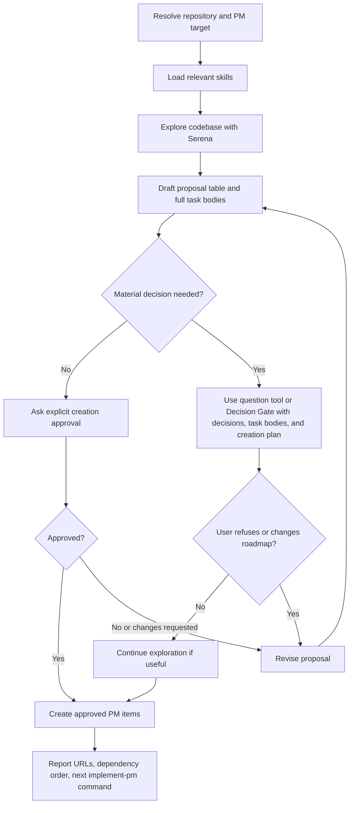

# Feed PM

## Purpose

Turn a product or engineering request into reviewable PM tasks that are grounded in the repository architecture and ready for a senior engineer to implement.

PBAW is a collaborative workflow: the user is the product and architecture authority, and the agent is the technical operator. Treat the user as a qualified software engineer: ask technical, architectural, product, and delivery questions when they materially affect the outcome. The agent discovers what can be discovered, proposes a concrete roadmap, and executes only the approved path.

## Inputs

Read `$ARGUMENTS` or equivalent natural language as:

- `pm_tool`: optional. Default to GitHub Issues when the repository remote supports it.
- `project`: optional. Accept a URL, name, ID, repository, page, or database target.
- `tasks`: required unless the request scope is already clear from conversation.

Ask only when the PM target cannot be resolved safely or missing product, technical, or architecture intent would make the plan misleading. Use built-in clarification/question tools when available; otherwise ask through the same Decision Gate in normal chat. Do not switch to Plan Mode just to access question tooling.

## References

Load only what is needed:

- `references/pm-tools.md` for PM target discovery and item creation.
- `references/codebase-analysis.md` for Serena exploration and responsibility maps.
- `references/task-specification.md` for proposal tables, task templates, sizing, and quality checks.

## Rules

- Explore the repo and PM target before asking broad planning questions.
- Use Serena first. If Serena is unavailable, stop instead of drafting implementation-ready tasks from local search alone.
- Load matching architecture, validation, testing, design-system, security, or workflow skills before decomposing work.
- Do not ask the user to identify files, components, schemas, owners, or PM metadata that can be discovered safely.
- Do not create, edit, label, move, assign, or otherwise mutate PM items before explicit post-proposal approval or Decision Gate approval.
- Record assumptions when you proceed on low-risk defaults.

## Decision Gates

Use built-in clarification/question tools when available for Decision Gates. When they are unavailable, present the same Decision Gate in normal chat. A Decision Gate is not a planning-only pause; it is an approval checkpoint that already contains the roadmap the agent will execute.

Every Decision Gate must:

- state the unresolved architect decisions and recommended defaults, including product, architecture, data model, validation, permission, API, UI, rollout, and task-boundary decisions when relevant;
- include the proposal table, full task bodies, target PM tool, dependency order, metadata, and creation plan as if no gate were needed;
- explain that the user's answer authorizes the roadmap unless they refuse, correct, or narrow it;
- avoid asking for files, schemas, owners, labels, or metadata that can be discovered.

After the user answers a Decision Gate:

- if the answer accepts, selects options, adds compatible detail, or does not object to the roadmap, continue exploration if useful and create the PM items directly;
- if the answer refuses, changes scope, contradicts the roadmap, or adds a constraint that invalidates the proposal, revise before creating;
- if the PM target is still unsafe to mutate, ask only for the missing target detail.

## Process Schema

## Workflow

1. Resolve the repository and PM target. Default to GitHub Issues only when safe.
2. Capture the user's stated goal, constraints, requested output, and implied assumptions.
3. Discover and load relevant skills. Record what each loaded skill changes about architecture, validation, testing, design, security, or workflow.
4. Explore the codebase with Serena. Find existing equivalents, owner layers, boundaries, reusable primitives, validation, data models, APIs, UI routes, jobs, integrations, tests, and risk surfaces.
5. Build a concise responsibility map: owner folders/layers, dependency direction, naming/placement rules, reusable services/schemas/components, cross-cutting constraints, and unresolved uncertainty.
6. Decompose into similarly sized, reviewable tasks. Prefer vertical slices when correct. Split shared foundations, migrations, permission changes, public API changes, and UI polish when that improves review quality.
7. Draft a proposal table and full task bodies. Each task starts with problem/outcome, scope, non-goals, owner layer, implementation anchors, architecture constraints, and acceptance criteria.
8. If needed, use built-in clarification/question tools when available, or show a Decision Gate otherwise, to clarify remaining product, technical, architecture, and planning intent while presenting the proposed tasks and creation plan: goal, users, roles, permissions, success criteria, non-goals, platforms, APIs, data, validation, architecture boundaries, UX, rollout, priority, dependencies, labels, owners, and task granularity.
9. Ask for explicit approval to create PM items when no Decision Gate has already approved the roadmap. Revise first if the user refuses, corrects, or narrows the proposal.
10. Create only approved PM items, preserve dependency order, link related tasks with stable URLs or IDs, and apply metadata only when requested or locally conventional.

## Completion Output

Finish with:

- PM tool and target used.
- Draft-only status or created task URLs.
- Dependency order.
- Suggested next command, for example `implement-pm for tasks #123 #124 #125`.

## Final Checklist

- [ ] 1. PM target and repository resolved safely.
- [ ] 2. User goal, constraints, and assumptions captured.
- [ ] 3. Relevant skills loaded and their constraints recorded.
- [ ] 4. Codebase explored with Serena; existing patterns and risk surfaces identified.
- [ ] 5. Remaining product, technical, architecture, or scope ambiguities clarified through built-in tooling or a portable Decision Gate when needed.
- [ ] 6. Responsibility map written before task decomposition.
- [ ] 7. Tasks split into reviewable, dependency-aware units.
- [ ] 8. Proposal table and full task bodies shown to the user.
- [ ] 9. Explicit post-proposal approval or Decision Gate approval received before PM mutation.
- [ ] 10. Approved items created, linked, ordered, and reported with the next command.
