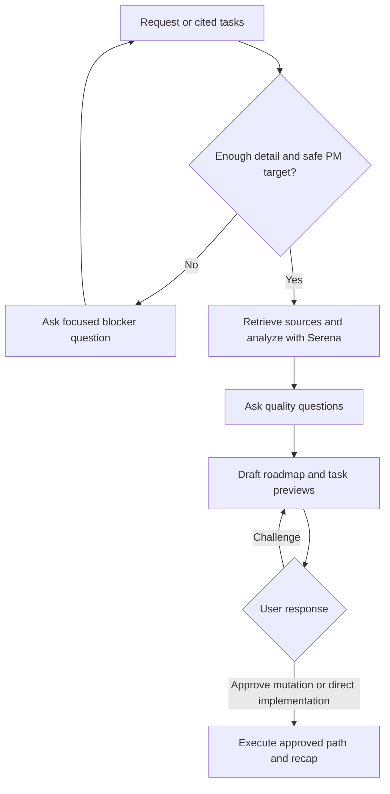
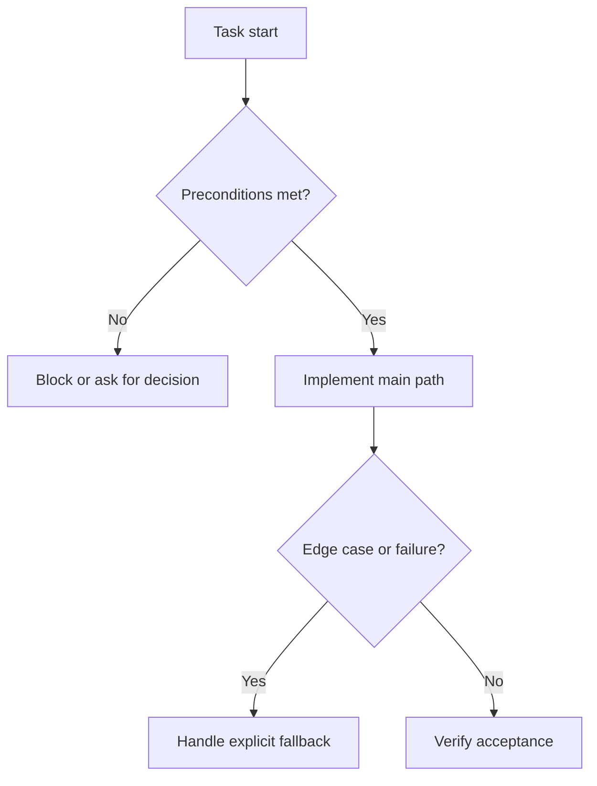

# Feed PM

## Summary

Turn one product or engineering request, cited PM task set, or mixed request into a repository-grounded Technical Roadmap and execution-ready PM tasks.

The input must include the requested outcome, cited PM tasks to retrieve, or both, plus a few implementation details. If those details are missing or too vague after reading cited PM tasks, ask for them before drafting tasks.

Plan Mode is recommended because it gives the model room to explore the repository, ask targeted questions, preserve context, review the Technical Roadmap, and revise the task split before mutating the PM system.

Always ask focused questions while preparing the plan. Use questions to improve project fit, implementation precision, data model/API choices, UX behavior, security posture, PM targeting, and blocker handling.

Never create or update PM tasks before explicit user approval of the proposed plan.

Do not plan new tests, new test files, or test-writing tasks unless the user explicitly requested tests. Verification should use existing checks or review points by default.

Treat lines of code as future maintenance cost. Prefer the smallest coherent diff, especially the fewest added lines after accounting for deleted lines. Propose small implementation or product concessions when they can remove hundreds of added lines without violating the requested outcome, security, or documented architecture, but wait for user approval before relying on those concessions.

Treat the user as the product and architecture authority, and as an experienced software engineer/architect.

## Diagram



## Inputs

Read the explicit invocation or user message as:

- `task_request`: product request, feature scope, bug, refactor, or backlog idea. Optional only when `source_pm_tasks` provide enough requested work.
- `source_pm_tasks`: optional cited PM task IDs, issue keys, issue numbers, or URLs, such as `PP-215`, `#215`, or a PM task URL. When present, these tasks are source input and update targets.
- `implementation_details`: useful implementation context. Accept any mix of desired behavior, target UX, affected surface, data model/API notes, existing files or modules to reuse, constraints, non-goals, rollout needs, security concerns, or preferred implementation direction.
- `pm_tool`: optional, for example `github`, `jira`, `notion`, or another installed PM MCP/CLI.
- `project_id`: optional repository, board, project, database, or PM target.

If both `task_request` and `source_pm_tasks` are missing, stop and ask for the requested work or PM tasks to process.

If `source_pm_tasks` are present, resolve the PM target, retrieve each cited task before repository analysis, and treat each task's current title, body, comments, URL, and stable ID as request context. If any cited task cannot be resolved or retrieved safely, stop and ask for the missing PM target detail.

If `implementation_details` are missing or too generic to produce implementation-ready tasks after combining `task_request` with retrieved source task content, ask focused technical questions before drafting the plan. Keep the questions few and high leverage.

If `pm_tool` or `project_id` are missing or unclear, fall back to GitHub Issues on the repository or repositories concerned by the request when the remotes, `gh` authentication, and issue settings make that safe. If the PM target cannot be resolved safely, ask for the missing PM target detail before creation or update.

For mixed input, cited PM tasks become update targets. Separately described work becomes additional new PM items unless the approved roadmap clearly maps it to a cited task. If mapping a roadmap task to an existing PM task is ambiguous, ask before mutating the PM system.

Preserve the language used by the user to describe the requested work for PM task titles, task bodies, proposed plans, and final recaps. Keep code identifiers, paths, commands, API names, and product terms literal.

## References

Load only the references needed for the current PM tool and request:

- `references/architecture-rules.md` before task decomposition.
- `references/codebase-analysis.md` for Serena exploration.
- `references/task-specification.md` for execution-ready PM task bodies.
- `references/pm-tools.md` for PM discovery, source retrieval, item creation, and approved update commands.
- `references/direct-implementation.md` when direct implementation is selected.
- `mermaid-diagrams` skill for one compact Mermaid flow per task preview and PM task body.

## Workflow

### Prepare

Load and respect all governing global and project-specific `AGENTS.md`, `CLAUDE.md`, and `GEMINI.md` files. Treat them as authoritative repository instructions; if they conflict, surface the conflict instead of silently choosing.

Load relevant architecture, design, security, framework, and provider resources before decomposing tasks when the request touches those areas.

Recommend Plan Mode when the runner supports it. Use the runner-native question or clarification tool when available; otherwise ask directly in chat.

### Retrieve Source PM Tasks

Detect cited PM task IDs, issue keys, issue numbers, and PM URLs in the user message. Use `references/pm-tools.md` to resolve and retrieve each cited task before deciding whether enough implementation detail exists.

Treat retrieved source PM tasks as input context and as the default PM items to update after approval. Preserve each source task's stable ID and URL in the roadmap, task previews, and final recap.

Do not mutate PM tasks during retrieval. If the cited tasks span multiple PM tools or projects, resolve each target explicitly before planning; ask when any target is ambiguous.

### Analyze The Project

Use Serena before drafting tasks. If Serena is unavailable, stop instead of creating implementation-ready tasks from local search alone.

Load and apply `references/architecture-rules.md` before task decomposition. Use it to identify ownership, reuse, duplication, validation, typing, design-system, data, backend, frontend, security, and task-boundary concerns.

Discover repository facts before final questions: files, ownership, schemas, routes, services, components, validators, conventions, check commands, and PM target signals.

Correlate the plan tightly to the project. Each task should name the owner area and expected new, modified, and deleted files using exact paths when discoverable and owner folders otherwise. If the project lacks enough architecture direction to plan safely, ask the user for the missing architecture decision instead of inventing it from the codebase.

Do not write local planning Markdown.

### Ask Quality Questions

Always ask at least one focused question set during planning, after initial repository exploration and before finalizing the proposed plan.

Prioritize questions that materially improve the task plan:

- UX behavior and user journeys;
- database tables, migrations, schema ownership, or data model changes;
- API contracts, validation, permissions, auth, and security boundaries;
- concrete implementation details, non-goals, rollout, and compatibility constraints;
- PM target, dependency order, or blockers that cannot be discovered from the repository.

Do not add repeated approval loops. Ask the focused question set, ask follow-up questions only for blockers, then present the complete plan for approval or challenge.

### Build The Roadmap And Task Contracts

Treat duplication as a primary decomposition concern. Detect duplicated code and near-duplicate code that should be standardized, such as two close React components that should become one component with variants.

Minimize net new implementation lines, not just task count. Prefer reusing, deleting, or extending existing owners over creating new abstractions. When a small concession in polish, generality, configuration, or optional behavior could remove many added lines, surface that concession for explicit user approval before making it part of the plan.

Do not force tasks to have equal size. Uneven tasks are correct when engineering boundaries are uneven.

Separate frontend, backend, and devops work into distinct PM tasks whenever the request touches more than one of those surfaces. Omit a surface only when it has no real implementation work.

Keep shared contracts, schemas, tokens, or foundations in their own task only when they are reused by several surfaces; do not hide frontend, backend, or devops implementation inside that shared task.

Do not create duplicate tasks for the same business rule, validator, component, or workflow.

Do not invent labels, statuses, assignees, milestones, project fields, or PM schema values.

Before asking for approval, present a Technical Roadmap for the whole task set. Use prose sections for implementation sequence, ownership boundaries, data/API/interface impact, risks, concessions requiring approval, and verification strategy. Do not include a single global Mermaid roadmap summary.

Use `mermaid-diagrams` for task-local diagrams only. Each task preview must include exactly one compact Mermaid `flowchart` for that task, and the same diagram must be included in the generated PM task body.

After the roadmap, show task previews. Each preview should summarize the execution contract that will be created in the PM item: implementation objective, owner and reuse path, expected file impact, interfaces/data flow, implementation steps, edge cases, external dependencies, acceptance criteria, verification, task dependencies, and the task-local Mermaid flow.

For each task, think through material edge cases before writing the diagram. The edge-case text and the Mermaid flow must stay consistent: include decision or failure nodes for validation failures, missing permissions, unavailable dependencies, migration/backfill risks, rollback or compatibility paths, blocked prerequisites, and user-approved concessions when those cases affect that task. Omit irrelevant branches that do not change implementation.

Do not copy the generic response-format diagram as-is. Replace every node with task-specific labels that name the real preconditions, implementation steps, edge cases, fallback handling, and acceptance verification for that task.

Do not include new tests, test files, test tasks, or test-writing acceptance criteria unless the user explicitly requested tests. Verification should reference existing lint, typecheck, test, build, or review commands when they already exist.

### Revise A Challenged Plan

When the user challenges the proposed plan:

1. Recover the previous proposed plan from the conversation before revising.
2. Preserve every plan detail that the user did not ask to change.
3. Adjust only the challenged scope, assumptions, task split, wording, dependencies, or PM target.
4. Return a complete replacement proposed plan, not a partial diff.

If the previous plan is no longer available in context, ask the user to provide or confirm the missing plan details before regenerating. This prevents accidental task loss.

### Create Or Update Tasks Or Implement Directly

After explicit user approval:

1. Reconfirm the approved plan in memory before mutating the PM system.
2. For each approved task mapped to a cited source PM task, overwrite the writable title/body or title/description with the approved execution contract from `references/task-specification.md`.
3. Preserve status, assignees, labels, project fields, comments, history, links, and other metadata unless the user explicitly approved changing them.
4. Create new PM items only for approved tasks that are not mapped to a cited source PM task, in dependency order.
5. Include task dependencies using native PM relationships when safely available; otherwise include dependency URLs in the task body.
6. Re-read or list updated and created PM items when the tool supports it, then return a short recap with updated task URLs, created task URLs, and the next `implement-pm` request details for all resulting task IDs.

If the user refuses creation, challenges the plan, changes the scope so much that the task set is invalid, or the PM target is unsafe to mutate, do not create or update tasks. Revise the plan or report the blocker as appropriate.

If the user asks to proceed directly with implementation, load `references/direct-implementation.md`. Do not create or update PM tasks, create a branch, invoke `implement-pm`, create a PR, launch `review-pr`, or enter the `fix-pr` loop. Implement directly from the approved plan on the current branch/worktree.

## Expected Response Format

Use this shape for planning, task creation, or direct implementation handoff:

````markdown
## Feed PM

PM tool: <tool>
Project: <target>
Source PM tasks: <task IDs/URLs or None>
Direct implementation: <yes | no>

Summary: <brief technical summary>

Technical Roadmap:
- Sequence: <ordered task path>
- Boundaries: <owner areas and responsibility split>
- Data/API/interface impact: <impact or "None">
- Minimal diff strategy: <reuse, deletion, simplification, concessions>
- Risks/blockers: <risk or "None">
- Verification: <existing checks or review points>

Task previews:

### <updates PM-ID | new> - <title>
Surface: <frontend | backend | devops | shared>
Objective: <implementation objective>
Owner/reuse: <owner area and existing primitive to reuse>
File impact: <expected new/modified/deleted paths>
Interfaces/data: <inputs, outputs, API/UI states, persisted data>
Edge cases: <material cases and handling>
Dependencies: <task or external dependency, or "None">
Verification: <existing checks or review points>



Assumptions: <assumptions or "None">
Concessions needing approval: <concessions or "None">
Result: <Proposed plan awaiting user choice | Updated/created task URLs | Direct implementation selected>
Next: <Challenge plan | Mutate PM tasks | Proceed directly | implement-pm request details>
````
