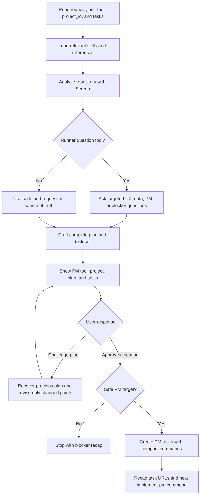

# Feed PM

## Summary

Turn one product or engineering request into a repository-grounded plan and PM tasks.

Plan Mode is recommended because it gives the model room to explore, ask targeted questions, preserve context, and revise the task split before mutating the PM system.

Use the runner-native question or clarification tool when it exists. If no such tool exists, let repository exploration and the user's request be the source of truth, then state assumptions in the proposed plan.

Never create PM tasks before explicit user approval of the proposed plan.

Treat the user as the product and architecture authority, and as an experienced software engineer/architect.

## Diagram



## Workflow

### Inputs

Read the explicit invocation or user message as:

- `pm_tool`: optional, for example `github`, `jira`, `notion`, or another installed PM MCP/CLI.
- `project_id`: optional repository, board, project, database, or PM target.
- `tasks`: required unless the request is clear from the conversation.

If `pm_tool` or `project_id` are missing or unclear, fall back to GitHub Issues on the repository or repositories concerned by the request when the remotes, `gh` authentication, and issue settings make that safe. If the PM target cannot be resolved safely, use the runner-native clarification tool when available; otherwise stop before creation and report the missing PM target detail.

Preserve the language used by the user to describe the requested work for PM task titles, task bodies, proposed plans, and final recaps. Keep code identifiers, paths, commands, API names, and product terms literal.

### References

Load only the references needed for the current PM tool:

- `references/architecture-rules.md` before task decomposition.
- `references/codebase-analysis.md` for Serena exploration.
- `references/task-specification.md` for concise PM task bodies.
- `references/pm-tools.md` for PM discovery and item creation commands.

### Planning Rules

- Use Serena before drafting tasks. If Serena is unavailable, stop instead of creating implementation-ready tasks from local search alone.
- Load and apply `references/architecture-rules.md`; use it to identify ownership, reuse, duplication, validation, typing, design-system, data, backend, frontend, security, and task-boundary concerns before proposing PM tasks.
- Load and respect all governing global and project-specific `AGENTS.md`, `CLAUDE.md`, and `GEMINI.md` files. Treat them as authoritative repository instructions; if they conflict, surface the conflict instead of silently choosing.
- Load relevant architecture, design, and security resources if any before decomposing tasks.
- Discover repository facts before asking the user: files, ownership, schemas, routes, services, components, validators, conventions, and check commands.
- Recommend Plan Mode when the runner supports it.
- Use the runner-native question or clarification tool when available for questions that materially change the plan, especially UX, database/data model, PM target, security posture, and blocking architecture decisions.
- If no question or clarification tool is available, do not invent a separate approval gate. Use the codebase and request as the source of truth, then list assumptions and defaults in the proposed plan.
- Treat duplication as a primary decomposition concern: detect duplicated code and near-duplicate code that should be standardized, such as two close React components that should become one component with variants.
- Match the PM task language to the dominant language the user used to describe the work.
- Do not force tasks to have equal size. Uneven tasks are correct when the engineering boundaries are uneven.
- Separate frontend, backend, and devops work into distinct PM tasks whenever the request touches more than one of those surfaces. Omit a surface only when it has no real implementation work.
- Keep shared contracts, schemas, tokens, or foundations in their own task only when they are reused by several surfaces; do not hide frontend, backend, or devops implementation inside that shared task.
- Do not write local planning Markdown.
- Do not create duplicate tasks for the same business rule, validator, component, or workflow.
- Do not invent labels, statuses, assignees, milestones, project fields, or PM schema values.

### Plan Revision

When the user challenges the proposed plan:

1. Recover the previous proposed plan from the conversation before revising.
2. Preserve every plan detail that the user did not ask to change.
3. Adjust only the challenged scope, assumptions, task split, wording, dependencies, or PM target.
4. Return a complete replacement proposed plan, not a partial diff.

If the previous plan is no longer available in context, ask the user to provide or confirm the missing plan details before regenerating. This prevents accidental task loss.

### Task Creation

After explicit user approval:

1. Reconfirm the approved plan in memory before mutating the PM system.
2. Create one PM item per task in dependency order.
3. Include task dependencies using native PM relationships when safely available; otherwise include dependency URLs in the task body.
4. Include a compact task summary with expected new, modified, and deleted files plus either a one-sentence technical readout or a compact plain-text diagram.
5. Return a short recap with task URLs and the next `implement-pm` request details.

If the user refuses creation, challenges the plan, changes the scope so much that the task set is invalid, or the PM target is unsafe to mutate, do not create tasks. Revise the plan or report the blocker as appropriate.

## Expected Response Format

### Proposed Plan

Use this exact shape before PM creation:

```markdown
## Feed PM Plan

PM tool: <tool>
Project: <project, repository, board, database, or PM target name>

Summary:
<brief technical summary of the requested work>

Assumptions:
- <assumption or "None">

Tasks to create:
- <task title 1> - <frontend|backend|devops|shared> - <one-line technical summary>
- <task title 2> - <frontend|backend|devops|shared> - <one-line technical summary>

Dependency order:
1. <task title 1>
2. <task title 2>

Verification:
- <existing check command or review point>

Est-ce que je peux passer a l'ajout de ces taches dans l'outil PM ?
```

### Final Response

```markdown
## Feed PM

PM target: <tool and project/repository target>

Created:

- <task id/title>: <url>

Dependency order:

1. <task id/title>
2. <task id/title>

Next:
Use `implement-pm` with `<pm-tool>` and `<task-ids>`.
```

If no tasks were created, replace `Created` with `Not created` and give the blocking reason.

## Checklist

- [ ] Repository and PM target resolved safely.
- [ ] Relevant architecture, design, and security resources if any are loaded before task decomposition.
- [ ] Global and project-specific `AGENTS.md`, `CLAUDE.md`, and `GEMINI.md` instructions loaded and respected.
- [ ] `references/architecture-rules.md` loaded before task decomposition.
- [ ] Serena used before task drafting.
- [ ] Plan Mode recommended when the runner supports it.
- [ ] Runner-native question or clarification tool used when available and materially useful.
- [ ] Existing architecture, validation, typing, business logic, and design-system patterns identified.
- [ ] Duplicated and near-duplicate code standardization opportunities identified and reflected in the task split.
- [ ] PM task language matches the language used by the user to describe the work.
- [ ] Frontend, backend, and devops work separated whenever more than one surface is involved.
- [ ] Each task summary lists expected new, modified, and deleted files, plus a one-sentence technical readout or compact plain-text diagram.
- [ ] Previous proposed plan recovered before revising a challenged plan.
- [ ] No local planning Markdown written.
- [ ] PM tasks created only after explicit user approval.
- [ ] Final recap includes task URLs, dependency order, and the next `implement-pm` request details.
