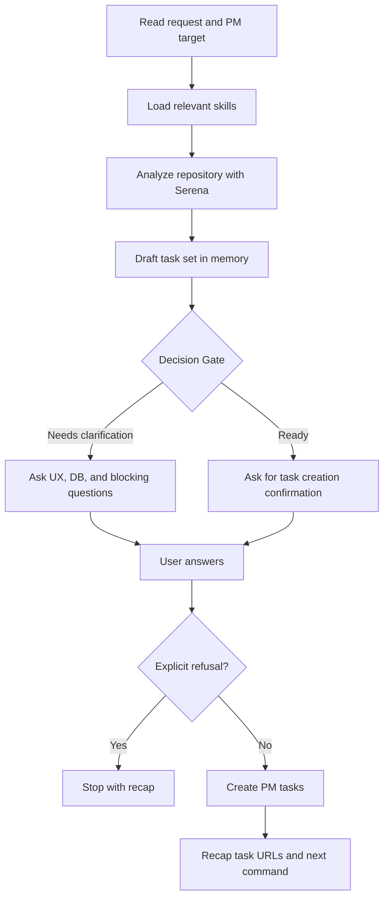

# Feed PM

## Summary

Turn one product or engineering request into PM tasks that are grounded in the codebase.

The workflow has one user stop: a mandatory Decision Gate. Use it either to ask the missing clarification questions or to confirm task creation. If the user answers clarification questions and does not explicitly refuse creation, create the tasks directly after that answer.

Treat the user as the product and architecture authority, and as an experienced software engineer/architect.

Use one stop only and do not use runner-specific clarification tools.

## Diagram



## Workflow

### Inputs

Read `$ARGUMENTS` or the user message as:

- `pm_tool`: optional, for example `github`, `jira`, `notion`, or another installed PM MCP/CLI.
- `project`: optional repository, board, project, database, or PM target.
- `tasks`: required unless the request is clear from the conversation.

Default `pm_tool` to GitHub Issues only when the current repository remote and `gh` state make that safe.

### References

Load only the references needed for the current PM tool:

- `references/codebase-analysis.md` for Serena exploration.
- `references/task-specification.md` for concise PM task bodies.
- `references/pm-tools.md` for PM discovery and item creation commands.

Load the `mermaid-diagrams` skill when a compact diagram would make task review materially clearer, such as data flow, sequence, ownership, or state transitions.

### Rules

- Use Serena before drafting tasks. If Serena is unavailable, stop instead of creating implementation-ready tasks from local search alone.
- Load relevant architecture, design, and security resources if any before decomposing tasks.
- Discover repository facts before asking the user: files, ownership, schemas, routes, services, components, validators, conventions, and check commands.
- Ask questions that affect user experience or database tables/data model even when not strictly blocking. For architecture, security, API, validation, delivery, and PM target, focus on blockers or decisions that materially change the task set.
- Use exactly one Decision Gate.
- Do not write local planning Markdown.
- Do not use runner-specific clarification tools. The Decision Gate is normal chat.
- Do not create duplicate tasks for the same business rule, validator, component, or workflow.
- Do not invent labels, statuses, assignees, milestones, project fields, or PM schema values.
- Create tasks even without an explicit "yes" when the user answered clarification questions and did not refuse task creation.

### Task Creation

After the Decision Gate response:

1. Apply the user's answers and conservative defaults.
2. Create one PM item per task in dependency order.
3. Include task dependencies using native PM relationships when safely available; otherwise include dependency URLs in the task body.
4. Add diagrams only when they reduce ambiguity.
5. Return a short recap with task URLs and the next `/implement-pm <pm-tool> <task-ids>` command.

If the user explicitly refuses creation, changes the scope so much that the task set is invalid, or the PM target is still unsafe to mutate, stop and report the blocker. Do not start a second Decision Gate.

## Expected Response Format

### Decision Gate

Use this exact shape for the single stop:

```markdown
## Decision Gate

I need one Decision Gate before creating PM tasks.

Questions or confirmation:

- <UX question, database/data-model question, blocker, or creation confirmation>

Recommended defaults:

- <default and why it is safe>

What I will create:

- <task title 1>
- <task title 2>

After your answer:

- I will create the PM tasks directly unless you explicitly refuse creation or change the scope.
```

### Final Response

```markdown
## Feed PM

PM tool: <tool and target>

Created:

- <task id/title>: <url>

Dependency order:

1. <task id/title>
2. <task id/title>

Next:
`/implement-pm <pm-tool> <task-ids>`
```

If no tasks were created, replace `Created` with `Not created` and give the blocking reason.

## Checklist

- [ ] Repository and PM target resolved safely.
- [ ] Relevant architecture, design, and security resources if any are loaded before task decomposition.
- [ ] `mermaid-diagrams` loaded when diagrams help task review.
- [ ] Serena used before task drafting.
- [ ] Existing architecture, validation, typing, business logic, and design-system patterns identified.
- [ ] Exactly one Decision Gate used.
- [ ] No local planning Markdown written.
- [ ] PM tasks created directly after a non-refusal Decision Gate answer.
- [ ] Final recap includes task URLs, dependency order, and `/implement-pm <pm-tool> <task-ids>`.
