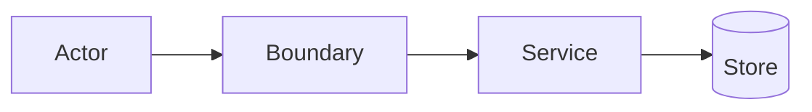

# Task Specification Reference

Use this reference to create concise PM task bodies. The PM item itself is the durable source of truth.

## Task Body Template

```markdown
## Outcome

<One sentence describing the user/developer-visible result.>

## Scope

- <included work>
- <included work>

## Non-Goals

- <explicitly excluded work, or "None">

## Implementation Notes

- Owner area: <folder/layer/component/service>
- Reuse: <existing service/schema/component/hook/validator/pattern>
- Constraints: <architecture, validation, auth, data, migration, or compatibility constraint>

## Acceptance Criteria

- [ ] <observable criterion>
- [ ] <observable criterion>
- [ ] <edge/failure criterion when relevant>

## Dependencies

- Depends on: <task URL/title or "none">
- Unblocks: <task URL/title or "none">

## Verification

- <existing command or review point>
```

## Optional Diagram

Use one compact Mermaid diagram only when it improves review clarity.



## Split Rules

Split tasks when one item mixes:

- migration plus UI;
- public API contract plus unrelated visual changes;
- permission model plus convenience refactor;
- shared foundation plus dependent feature work;
- multiple independent journeys;
- several risky integrations.

Merge tasks when separation adds noise:

- a type and its only consumer;
- a schema field and the single service branch that owns it;
- a small hook and the only UI caller.

## Quality Bar

- One primary owner area per task.
- Dependencies are explicit and acyclic.
- Shared rules, validators, schemas, services, and query keys have one owner.
- Acceptance criteria are observable.
- Titles are action-oriented: `<verb> <scoped technical outcome>`.
- Verification references existing checks unless the user explicitly requested new tests.
