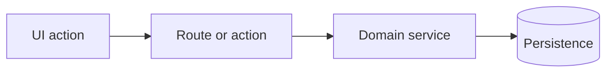

# Task Specification Reference

Use this reference when drafting the proposed PM items. The goal is a task body that a senior engineer can review quickly and an implementation agent can execute without re-planning the feature.

## Proposal Table

Show this table before creating anything:

```markdown
| Order | Title | Type | Size | Owner layer | Depends on | Main files/symbols | Risk |
| ----- | ----- | ---- | ---- | ----------- | ---------- | ------------------ | ---- |
| 1 | <title> | <feature|bug|refactor|chore> | <S|M|L> | <owner> | <none|task> | <anchors> | <low|medium|high> |
```

## Issue Body Template

Use this exact structure for every PM task:

```markdown
## Digest

**Outcome:** <one sentence describing the user/developer-visible result>

**Scope:** <what is included>

**Non-goals:** <what must not be changed in this task>

**Owner layer:** <owning folder/layer and why>

**Implementation anchors:** <short list of key files/symbols/patterns to reuse>

**Architecture constraints:** <loaded skills and repository boundaries that matter>

**Acceptance criteria:**
- [ ] <observable criterion>
- [ ] <observable criterion>
- [ ] <relevant failure/edge criterion>

## Context

<Why this task exists, what upstream task/product goal it supports, and important constraints discovered in the repo.>

## Technical Plan

1. <implementation step>
2. <implementation step>
3. <implementation step>

## Contracts And Data

<DTOs, schemas, API shapes, query keys, state transitions, permissions, migrations, or event contracts. Omit if not applicable.>

## Dependencies

- Depends on: <issue numbers or "none">
- Unblocks: <issue numbers or "unknown until creation">

## Verification

<Relevant existing commands/checks and manual review points. Do not require new tests unless the task or project explicitly requires them.>

## Reviewer Notes

<Risk areas, compatibility constraints, rollback notes, or what deserves careful human review.>
```

## Size Rubric

Split tasks when one item mixes:

- migration plus UI;
- public API contract plus unrelated visual changes;
- permission model plus convenience refactor;
- shared foundation plus dependent feature work;
- multiple independent user journeys;
- several risky integrations that need separate review attention.

Merge tasks when separation would produce noise:

- a type and its only consumer;
- a schema field and the single service branch that owns it;
- a small hook and the only UI caller;
- tiny verification-only work tied to one behavior.

## Optional Mermaid Diagram

Use one compact diagram only when it clarifies sequencing, data flow, ownership, or state transitions:



## Quality Checklist

- Every task has one primary owner area.
- Dependencies are explicit and acyclic.
- Shared rules, validators, services, schemas, and query keys appear in one task and one eventual code owner.
- Acceptance criteria are observable and not tied to private implementation details.
- Titles are action-oriented: `<verb> <scoped technical outcome>`.
- Verification references existing commands unless the user or project explicitly requires new tests.
