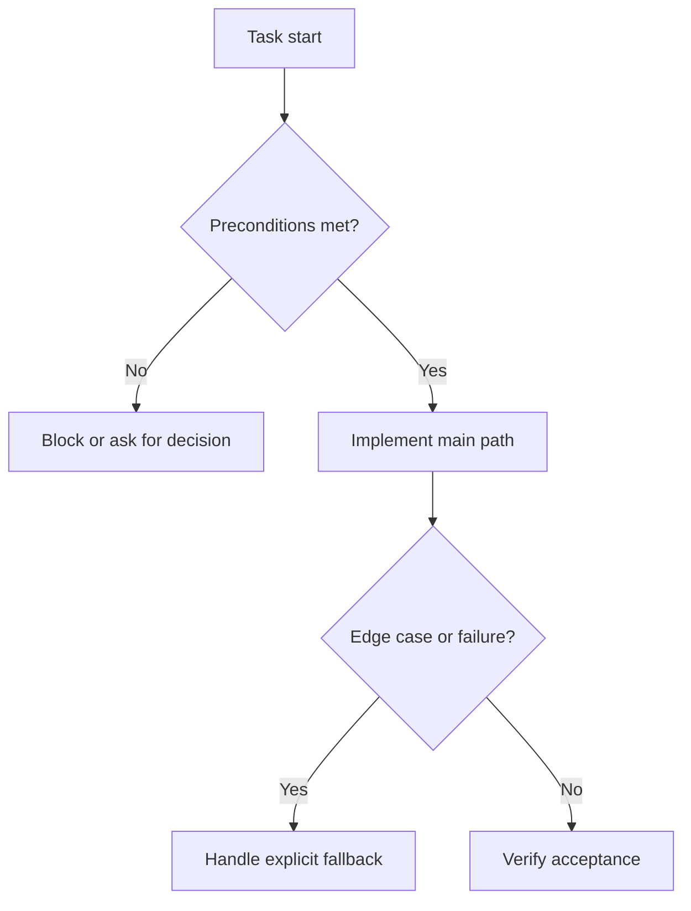

# Task Specification Reference

Use this reference to create or update PM task bodies as execution contracts. The PM item itself is the durable source of truth for the implementer.

## Execution Contract Template

````markdown
## Summary
<One-sentence task purpose and roadmap role.>

## Task Flow


## Contract
- Objective: <exact outcome>
- Owner/reuse: <owner area plus existing service/schema/component/hook/validator/pattern to reuse>
- File impact: <new/modified/deleted paths, or owner folders when exact paths are not knowable>
- Interfaces/data: <inputs, outputs, persisted data, API/UI states, or "None">
- Steps: <ordered implementation steps>
- Edge cases: <material failures and handling, or "None">
- External dependencies: <package/service/API, docs to check with Context7, or "None">
- Acceptance: <observable criteria>
- Verification: <existing checks or review points; no new tests unless requested>
- Dependencies: <depends on / unblocks, or "None">
````

## Contract Rules

- Write enough technical detail for implementation without re-planning the roadmap.
- Keep one primary owner area per task and name exact paths when discoverable.
- Preserve the user's language for titles and prose; keep paths, commands, identifiers, APIs, and product names literal.
- Include the smallest coherent file impact: reuse, deletion, simplification, or user-approved concession before parallel code.
- Keep external dependencies inside the relevant task only; write `None` when absent.
- Include exactly one Mermaid `flowchart` in each PM task body under `## Task Flow`.
- Keep the diagram task-local, operational, and compact; do not add a global roadmap diagram to task bodies.
- Replace template node labels with concrete task-specific steps, decisions, edge cases, fallbacks, blockers, and verification points.
- Make the diagram and `Edge cases` field cover the same material branches: validation failures, missing permissions, unavailable dependencies, migration/backfill risks, rollback or compatibility paths, blocked prerequisites, and approved concessions when they affect the task.

## Split Rules

- Split by engineering surface first: frontend, backend/data/API/security, and devops/infrastructure when each has real work.
- Use a shared foundation task only when several surfaces depend on the same schema, contract, token, data model, or reusable primitive.
- Merge tiny coupled changes when separation adds noise, such as a type and its only consumer.
- Do not hide frontend, backend, or devops implementation inside a shared task.

## Quality Bar

- Dependencies are explicit and acyclic.
- Shared rules, validators, schemas, services, and query keys have one owner.
- Steps are concrete and ordered; acceptance criteria are observable.
- Edge cases are explicit in prose and represented in the task flow when they change implementation behavior.
- Verification references existing checks unless the user explicitly requested new tests.
- Task scope excludes new tests, test files, and test-writing work unless explicitly requested.
