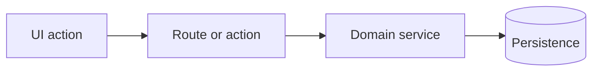

# Task Specification Reference

Use this reference when drafting the proposed PM items into persistent plan files. The goal is a task body that a senior engineer can review quickly and an implementation agent can execute without re-planning the feature.

## Plan File Layout

Write every `feed-pm` plan under `~/pbaw-plans`:

```text
~/pbaw-plans/
`-- <YYYYMMDD-HHMMSS>-<request-slug>/
    |-- index.md
    |-- 01-<explicit-task-title>.md
    |-- 02-<explicit-task-title>.md
    `-- 03-<explicit-task-title>.md
```

Use lowercase kebab-case slugs for directories and task files. Keep names explicit enough to identify the task without opening the file. Reuse the same request directory for revisions to the same user request.

## Index Template

Write `index.md` with this structure:

```markdown
# <Request title>

## Review Status

- Status: <draft|needs clarification|ready for review|confirmed for PM creation|created>
- PM target: <tool and repository/project/database>
- Last updated: <local timestamp>
- Source request: <short user request summary>

## Open Clarifications

<Questions that still block a reliable PM plan, or "None.">

## Assumptions

- <assumption or "None.">

## Responsibility Map

<Concise repository responsibility map grounded in discovered code.>

## Proposal

| Order | Title | Type | Size | Owner layer | Depends on | Main files/symbols | Risk | Plan file |
| ----- | ----- | ---- | ---- | ----------- | ---------- | ------------------ | ---- | --------- |
| 1 | <title> | <feature|bug|refactor|chore> | <S|M|L> | <owner> | <none|task> | <anchors> | <low|medium|high> | [01-...](./01-....md) |

## Dependency Order

1. <task title>
2. <task title>

## Metadata To Apply

- Labels: <approved or discovered labels, or "None">
- Assignees: <approved or discovered assignees, or "None">
- Milestone/status/project fields: <approved or discovered fields, or "None">

## Creation Plan

<PM creation commands or MCP actions to run after final confirmation.>
```

## Proposal Table

Use this table in `index.md` before creating anything:

```markdown
| Order | Title | Type | Size | Owner layer | Depends on | Main files/symbols | Risk | Plan file |
| ----- | ----- | ---- | ---- | ----------- | ---------- | ------------------ | ---- | --------- |
| 1 | <title> | <feature|bug|refactor|chore> | <S|M|L> | <owner> | <none|task> | <anchors> | <low|medium|high> | [01-...](./01-....md) |
```

## Issue Body Template

Use this exact structure for every PM task:

```markdown
## Digest

**Outcome:** <one sentence describing the user/developer-visible result>

**Scope:** <what is included>

**Non-goals:** <what must not be changed in this task>

**Owner layer:** <owning folder/layer and why>

**Implementation anchors:** <short list of key files/symbols/patterns to reuse>

**Architecture constraints:** <loaded skills and repository boundaries that matter>

**Acceptance criteria:**
- [ ] <observable criterion>
- [ ] <observable criterion>
- [ ] <relevant failure/edge criterion>

## Context

<Why this task exists, what upstream task/product goal it supports, and important constraints discovered in the repo.>

## Technical Plan

1. <implementation step>
2. <implementation step>
3. <implementation step>

## Contracts And Data

<DTOs, schemas, API shapes, query keys, state transitions, permissions, migrations, or event contracts. Omit if not applicable.>

## Dependencies

- Depends on: <issue numbers or "none">
- Unblocks: <issue numbers or "unknown until creation">

## Verification

<Relevant existing commands/checks and manual review points. Do not require new tests unless the task or project explicitly requires them.>

## Reviewer Notes

<Risk areas, compatibility constraints, rollback notes, or what deserves careful human review.>
```

The task file content is also the PM item body source after final confirmation. Update dependencies from provisional titles to stable issue URLs or numbers after PM creation when the selected PM tool supports editing.

## Size Rubric

Split tasks when one item mixes:

- migration plus UI;
- public API contract plus unrelated visual changes;
- permission model plus convenience refactor;
- shared foundation plus dependent feature work;
- multiple independent user journeys;
- several risky integrations that need separate review attention.

Merge tasks when separation would produce noise:

- a type and its only consumer;
- a schema field and the single service branch that owns it;
- a small hook and the only UI caller;
- tiny verification-only work tied to one behavior.

## Optional Mermaid Diagram

Use one compact diagram only when it clarifies sequencing, data flow, ownership, or state transitions:



## Quality Checklist

- Every task has one primary owner area.
- Dependencies are explicit and acyclic.
- Shared rules, validators, services, schemas, and query keys appear in one task and one eventual code owner.
- Acceptance criteria are observable and not tied to private implementation details.
- Titles are action-oriented: `<verb> <scoped technical outcome>`.
- Verification references existing commands unless the user or project explicitly requires new tests.
- The user response links `index.md` for review instead of pasting the table and task bodies inline.
