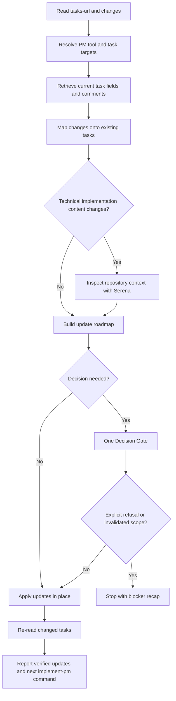

# Fix PM

## Summary

Adjust already-created PM tasks in place.

This skill edits PM task specifications. It does not implement code, create implementation branches, create PRs, review PRs, merge, or close tasks by default.

Use no Decision Gate when the requested changes are unambiguous. Use exactly one Decision Gate when task identity, PM target, split/merge/delete/create behavior, UX, data model, security posture, or PM schema changes are unclear or risky.

After the user answers the Decision Gate, apply the update roadmap directly unless they explicitly refuse or change the scope so much that the roadmap is invalid.

## Diagram



## Workflow

### Inputs

Required inputs:

- `tasks-url`: one or more existing task URLs or task IDs.
- `changes`: requested updates to apply to those tasks.

Do not guess missing inputs. Ask for the missing information if either value is missing.

Infer the PM tool from `tasks-url` when possible. If URLs or IDs span several PM tools or repositories, resolve every target before editing and stop if any target is unsafe to mutate.

### References

Load only what is needed:

- `references/pm-task-adjustment.md` for PM task retrieval, update, and verification mechanics.
- `../feed-pm/references/task-specification.md` when task bodies need to keep the `feed-pm` specification shape.

### Rules

- Retrieve the current title, body, comments, dependencies, backlinks, status, labels, assignees, milestones, and project fields when the PM tool exposes them.
- Update existing tasks in place. Do not create duplicate PM tasks.
- Do not create, archive, delete, close, or split tasks unless the requested changes explicitly require it and the Decision Gate confirms the structure.
- Use Serena before changing implementation details, file paths, dependency boundaries, API contracts, data models, validation, authorization, or deployment work. Pure wording or PM metadata edits do not require Serena.
- Preserve PM task language unless the requested changes clearly use another language for the replacement text. Keep code identifiers, paths, commands, API names, and product terms literal.
- Preserve frontend, backend, and devops task boundaries. If the change crosses surfaces, update the matching task for each surface instead of collapsing work into one item.
- Do not invent labels, statuses, assignees, milestones, project fields, dependency relations, or PM schema values.
- Do not update implementation branches, PR bodies, PR backlinks, review comments, or PM completion status.
- Re-read every changed task after updating it and verify the durable title/body/dependency state.

### Task Adjustment

1. Resolve every task from `tasks-url`.
2. Read each task's current durable fields and recent relevant comments.
3. Map `changes` onto the existing tasks, preserving dependencies and task boundaries.
4. Use Serena if the update changes technical implementation content.
5. If needed, use one Decision Gate with the update roadmap.
6. Apply updates in dependency order.
7. Re-read changed tasks and report verified URLs/IDs.

If the user explicitly refuses, the task set cannot be resolved safely, or the requested change requires a second Decision Gate, stop and report the blocker.

## Expected Response Format

### Decision Gate

Use this exact shape only when needed:

```markdown
## Decision Gate

I need one decision before updating PM tasks.

Decision:
- <question or choice>

Recommended default:
- <default and why>

Update roadmap:
- Update: <task URL/title> - <change>
- Leave unchanged: <task URL/title and reason>
- Create/archive/delete/split: <action or "none">

After your answer:
- I will apply this roadmap directly unless you explicitly refuse or change the scope.
```

### Final Response

```markdown
## Fix PM

Updated:
- <task id/title>: <url> - <change>

Created, archived, deleted, or split:
- <item or "none">

Unchanged:
- <item or "none">

Verification:
- <task id/title>: <verified|blocked> - <short note>

Remaining:
- <blocker or "none">

Next:
Use `implement-pm` with `<pm-tool>` and `<task-ids>`.
```

If no tasks were updated, replace `Updated` with `Not updated` and give the blocking reason.

## Checklist

- [ ] `tasks-url` and `changes` parsed exactly.
- [ ] PM tool and every task target resolved safely.
- [ ] Current task fields and relevant comments read before editing.
- [ ] Serena used when technical implementation content changed.
- [ ] Existing tasks updated in place without duplicate task creation.
- [ ] Frontend, backend, and devops task boundaries preserved.
- [ ] At most one Decision Gate used.
- [ ] No implementation branches, PRs, reviews, merges, or completion statuses updated.
- [ ] Changed tasks re-read and verified.
- [ ] Final recap includes task URLs, verification state, and the next `implement-pm` request details when applicable.
