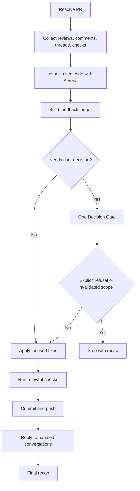

# Fix PR

## Summary

Fix PR review feedback in one focused pass.

This skill fixes and replies. It does not rescore, approve, merge, close issues, or move PM items.

Use no Decision Gate when feedback is unambiguous. Use exactly one Decision Gate when feedback is ambiguous, conflicting, product-changing, architecture-changing, dependency-adding, test-creating, or outside the PM task scope.

After the user answers the Decision Gate, apply the remediation roadmap directly unless they explicitly refuse or change the scope so much that the roadmap is invalid.

## Diagram



## Workflow

### Inputs

Optional:

- `PR`: PR URL, number, or branch.
- `repository`: repository path or owner/repo.
- `scope`: subset of feedback, for example `blockers only` or a review thread URL.

Default to the PR associated with the current branch. In a workspace, include matching child-repository PRs.

### References

Load only what is needed:

- `references/github-feedback.md` for feedback collection and ledger commands.
- `references/remediation-git-github.md` for checkout, commit, push, replies, and thread resolution.

### Rules

- Use Serena to inspect cited code and nearby ownership before editing. If Serena is unavailable, stop.
- Load and respect all governing global and project-specific `AGENTS.md`, `CLAUDE.md`, and `GEMINI.md` files. Treat them as authoritative repository instructions; if they conflict, surface the conflict instead of silently choosing.
- Treat outdated threads as context and verify whether the current head already addresses them.
- Preserve unrelated local work. Do not stash, reset, unstage, delete, or commit unrelated changes unless explicitly requested.
- Group duplicate feedback into one fix, but map every conversation to a reply, resolution, or no-change reason.
- Reuse existing code, schemas, services, validators, components, hooks, and design-system primitives.
- Do not add dependencies, logs, broad refactors, unrelated cleanup, or new tests by default.
- Do not merge, mark PRs ready, close PM tasks, or update PM status.
- Do not use runner-specific clarification tools.
- Do not loop after the Decision Gate.
- Reply to each handled thread with what changed, the commit SHA when available, and the checks run.

## Expected Response Format

### Decision Gate

Use this exact shape only when needed:

```markdown
## Decision Gate

I need one decision before fixing the PR.

Decision:
- <question or choice>

Recommended default:
- <default and why>

Remediation roadmap:
- Fix: <item>
- Leave unchanged: <item and reason>
- Checks: `<command>`
- PR replies: <thread/comment handling>

After your answer:
- I will apply this roadmap directly unless you explicitly refuse or change the scope.
```

### Final Response

```markdown
## Fix PR

PR: <url>
Branch: <branch>
Commit: <sha or "none">

Fixed:
- <item>

Clarified or unchanged:
- <item or "none">

Checks:
- `<command>`: <passed|failed|not run> - <short note>

PR updates:
- <reply/resolution/comment status, including what changed, commit SHA when available, and checks run>

Remaining:
- <blocker or "none">

Next:
`review-pr`
```

## Checklist

- [ ] PR and feedback resolved.
- [ ] Serena used for cited code and nearby ownership.
- [ ] Global and project-specific `AGENTS.md`, `CLAUDE.md`, and `GEMINI.md` instructions loaded and respected.
- [ ] Feedback ledger built before editing.
- [ ] Outdated threads checked against current head before fixing or replying.
- [ ] At most one Decision Gate used.
- [ ] Focused fixes applied with existing patterns reused.
- [ ] Relevant checks run or reported.
- [ ] Remediation changes committed and pushed when code changed.
- [ ] Handled conversations replied to or resolved only when actually handled.
- [ ] Final response points to `review-pr`.
