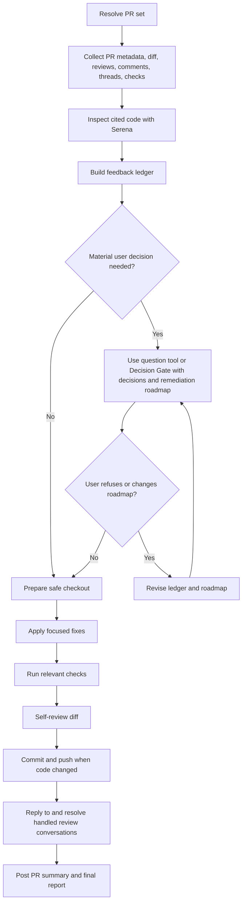

# Fix PR

## Purpose

Turn PR review feedback into a focused remediation pass. This skill fixes and replies; it does not rescore, approve, merge, close issues, or move PM items unless the user explicitly asks.

PBAW is a collaborative workflow: the user is the product and architecture authority, and the agent is the technical operator. Treat the user as a qualified software engineer: ask technical, architectural, product, and delivery questions when they materially affect the remediation. The agent collects feedback, proposes a concrete remediation roadmap, and executes the approved path.

## Inputs

No argument is required for the normal workflow. Resolve the PR from the current branch first, including matching child-repository branches in a multi-repo workspace.

Read `$ARGUMENTS` or equivalent natural language as optional overrides:

- `PR`: PR URL, PR number, or branch name.
- `Repository`: repository URL, identifier, or child repository path.
- `Scope`: feedback subset such as `blockers only`, `all review comments`, reviewer name, comment URL, or review thread URL. Default to all unresolved actionable feedback.

Ask one concise question only when the PR cannot be resolved or multiple unrelated PRs match. Use built-in clarification/question tools when available; otherwise ask through the same Decision Gate in normal chat. Do not switch to Plan Mode just to access question tooling.

## References

Load only what is needed:

- `references/github-feedback.md` for PR context, feedback collection, review-thread queries, and feedback ledger format.
- `references/remediation-git-github.md` for checkout, push access, commits, review replies, thread resolution, and fallback summaries.

## Rules

- Collect the full feedback context before editing.
- Use Serena to inspect cited lines and nearby code. If Serena is unavailable, stop instead of applying fixes from local search alone.
- Treat outdated threads as context: verify whether current head already addresses the concern.
- Group duplicate comments under one corrective action, but keep every GitHub conversation mapped to a reply or explicit no-change reason.
- Ask before fixing ambiguous, conflicting, broad, product-changing, dependency-adding, test-creating, PM-scope-changing, or unrelated-code feedback.
- Preserve unrelated local work. Do not stash, unstage, commit, revert, or delete unrelated changes unless explicitly requested.
- Do not add dependencies, logs, broad refactors, unrelated cleanup, or new tests by default.

## Decision Gates

Use built-in clarification/question tools when available for Decision Gates. When they are unavailable, present the same Decision Gate in normal chat. A Decision Gate is not a planning-only pause; it is an approval checkpoint that already contains the remediation roadmap the agent will execute.

Every Decision Gate must:

- cite the review comments, checks, files, product areas, architecture boundaries, contracts, validation rules, or data flows that need architect input;
- state the decision, recommended default, impact, and planned response for each item, including technical and architecture tradeoffs when relevant;
- include the concrete remediation roadmap: fixes, non-fixes, check commands, commit/push intent, and PR reply plan;
- explain that the user's answer authorizes the roadmap unless they refuse, correct, or narrow it.

After the user answers a Decision Gate:

- if the answer accepts, selects options, adds compatible detail, or does not object to the roadmap, apply the remediation directly;
- if the answer refuses, changes scope, contradicts the roadmap, or adds a constraint that invalidates the plan, revise before editing;
- if PR resolution or checkout safety remains ambiguous, ask only for the missing blocking detail.

## Process Schema



## Workflow

1. Resolve the PR set. In a normal repository, use the current Git root. In a workspace with child Git repositories, resolve matching PRs in each owning child repo.
2. Read PR title, body, changed files, diff, reviews, issue comments, review comments, review threads, checks, state, draft state, base, head, and URL.
3. Inspect project instructions and existing code patterns relevant to the feedback.
4. Build a feedback ledger before editing. For each item record source, URL/thread ID, location, concern, status, intended response, and whether the thread should be resolved.
5. Triage in this order: blockers/requested changes/failed checks/security/correctness, major architecture/validation/data/regression concerns, minor actionable fixes, then clarifications or non-actionable comments.
6. If material input is needed, use built-in clarification/question tools when available, or show one Decision Gate otherwise, before editing ambiguous items. Cite the comment or file area, state the decision, recommend a conservative default when clear, explain the impact, and include the remediation roadmap.
7. Prepare the checkout. Move to the PR head branch only when safe, confirm push access, and keep multi-repo fixes scoped to the repository that owns each PR.
8. Apply focused fixes. Reuse existing services, hooks, schemas, validators, DTOs, repositories, utilities, components, tokens, variants, and test helpers. Keep business rules centralized and authorization server-side.
9. Run relevant existing checks for the touched area. Avoid dev servers, containers, browser automation, and watch commands by default.
10. Self-review the diff. Ensure each changed file maps to feedback, no unrelated user edits are staged, and no secrets were added.
11. Commit and push remediation changes when code changed. Do not create an empty commit for already-fixed, obsolete, or clarification-only feedback.
12. Reply to each handled review thread or comment. Include what changed, commit SHA when available, and checks run. Resolve only threads fixed, already fixed, or fully clarified by a successful API operation.
13. Add one top-level PR comment per PR summarizing fixed items, clarification-only items, checks, commit SHA, and remaining items.
14. Report the result with repository, PR, branch, commit, fixed items, clarified/already addressed items, PR updates, checks, remaining blockers, and the next `review-pr` step.

## Output Format

```markdown
## Fix PR

Repository: <path>
PR: <url>
Branch: <head branch>
Commit: <sha or "none">

### Fixed
- <feedback item fixed, with file/area and reviewer thread/comment reference>

### Clarified Or Already Addressed
- <feedback item clarified, already fixed, obsolete, or out of scope, with reason>

### PR Updates
- <thread replies, resolved conversations, fallback comments, or unavailable operations>

### Checks
- `<command>`: <passed|failed|not run> - <short note>

### Remaining
- <open reviewer/user decision, failed check, push blocker, or "none">

### Next
- Run `review-pr` again from the PR branch or workspace if a fresh production-readiness score is needed.
```

## Final Checklist

- [ ] 1. PR set resolved from current branch or explicit input, including child repos.
- [ ] 2. PR metadata, diff, checks, reviews, issue comments, review comments, and review threads collected.
- [ ] 3. Serena and project instructions used to understand cited code and local patterns.
- [ ] 4. Feedback ledger built before editing, with every conversation mapped.
- [ ] 5. Ambiguous or conflicting feedback clarified through built-in tooling or a portable Decision Gate before code changes.
- [ ] 6. Checkout prepared safely and unrelated local work preserved.
- [ ] 7. Focused fixes applied with existing patterns and centralized business logic.
- [ ] 8. Relevant existing checks run and caused failures handled.
- [ ] 9. Diff self-reviewed, staged narrowly, committed, and pushed when code changed.
- [ ] 10. Each handled thread/comment replied to; only successfully resolved threads claimed as resolved.
- [ ] 11. Top-level PR summary posted or fallback reported.
- [ ] 12. Final report includes remaining blockers and the next `review-pr` step.
