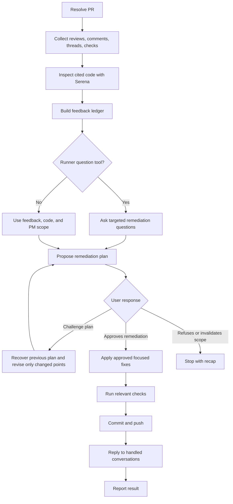

# Fix PR

## Summary

Fix PR review feedback in one focused pass.

This skill fixes and replies. It does not rescore, approve, merge, close issues, or move PM items.

Always propose a remediation plan before editing. Wait for explicit user approval before applying any PR feedback fixes.

Recommend Plan Mode, use the runner-native question or clarification tool when available, and make the plan complete enough to apply without further decisions. If no question or clarification tool is available, use PR feedback, repository evidence, and the approved PM scope as the source of truth, then state assumptions in the remediation plan.

## Diagram



## Inputs

Optional:

- `PR`: PR URL, number, or branch.
- `repository`: repository path or owner/repo.
- `scope`: subset of feedback, for example `blockers only` or a review thread URL.

Default to the PR associated with the current branch. In a workspace, include matching child-repository PRs.

## References

Load only what is needed:

- `references/github-remediation.md` for feedback collection, remediation ledger, checkout, commit, push, replies, and thread resolution.
- `../implement-pm/references/development-rules.md` before editing and before the final diff review.

## Workflow

### Rules

- Use Serena to inspect cited code and nearby ownership before editing. If Serena is unavailable, stop.
- Load and follow `../implement-pm/references/development-rules.md`; use it for focused edits, local change safety, relevant checks, and final diff review.
- Load and respect all governing global and project-specific `AGENTS.md`, `CLAUDE.md`, and `GEMINI.md` files. Treat them as authoritative repository instructions; if they conflict, surface the conflict instead of silently choosing.
- Treat outdated threads as context and verify whether the current head already addresses them.
- Preserve unrelated local work. Do not stash, reset, unstage, delete, or commit unrelated changes unless explicitly requested.
- Group duplicate feedback into one fix, but map every conversation to a reply, resolution, or no-change reason.
- Reuse existing code, schemas, services, validators, components, hooks, and design-system primitives.
- Do not add dependencies, logs, broad refactors, unrelated cleanup, or new tests by default.
- Minimize added lines relative to deleted lines in every remediation. Prefer deletion, reuse, and extension; if a small concession would reduce added lines substantially, include it in the remediation plan and wait for explicit user approval.
- Do not merge, mark PRs ready, close PM tasks, or update PM status.
- Reply to each handled thread with what changed, the commit SHA when available, and the checks run.

### Remediation Planning

Always build a remediation plan after the feedback ledger is built and before editing.

For every remediation plan:

1. Recommend Plan Mode when the runner supports it.
2. Use the runner-native question or clarification tool when available for decisions that materially change the fix.
3. If no question or clarification tool is available, use PR feedback, repository evidence, and the approved PM scope as the source of truth.
4. Include all fixes, explicit non-fixes, assumptions, checks, and PR reply handling.
5. Include any concession that would materially reduce added lines, and wait for explicit user approval before editing.

When the user challenges the remediation plan:

1. Recover the previous remediation plan from the conversation before revising.
2. Preserve every detail that the user did not ask to change.
3. Adjust only the challenged fix, assumption, non-fix, check, reply, or scope boundary.
4. Return a complete replacement remediation plan, not a partial diff.

If the previous remediation plan is no longer available in context, ask the user to provide or confirm the missing details before regenerating. This prevents accidental feedback loss.

## Expected Response Format

Use this shape for the remediation plan, applied fix recap, or blocker:

```markdown
## Fix PR

PR: <url>
Branch: <branch>
Commit: <sha or "none">

Summary:
<brief technical summary of the feedback and intended remediation>

Assumptions:

- <assumption or "None">

Fix:

- <item>

Leave unchanged:

- <item and reason, or "None">

Checks:

- `<command>`

Diff discipline:

- <how remediation minimizes added lines relative to deleted lines, or concession needing approval>

PR replies:

- <thread/comment handling>

Remaining:

- <blocker or "none">

Result:
<Remediation plan awaiting approval | Applied focused fixes | Blocked or not changed>

Next:
<approve remediation | `review-pr` | exact blocker action>
```
