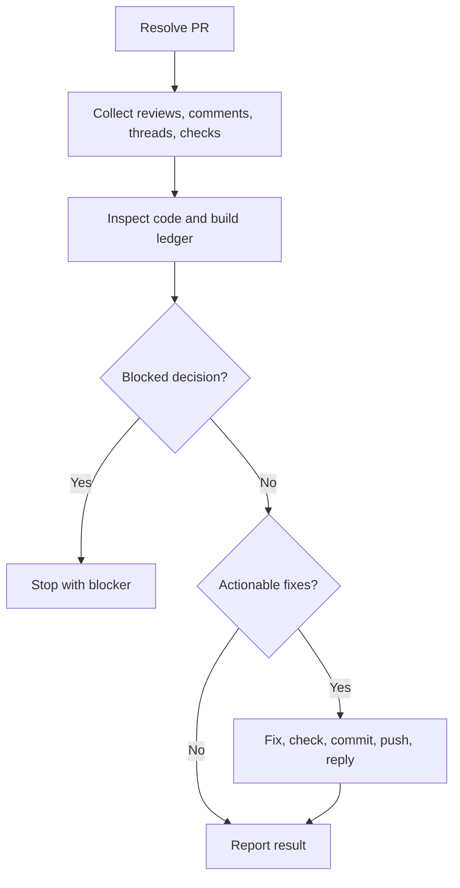

# Fix PR

## Summary

Fix PR review feedback in one focused pass.

This skill fixes and replies directly. It does not rescore, approve, merge, close issues, or move PM items.

Collect the PR feedback, classify each item, inspect cited code, apply focused fixes, run checks, commit and push, then reply to PR conversations. Ask the user only when a blocker requires a product, architecture, security, access, or scope decision that cannot be inferred from the PR feedback and repository instructions.

## Diagram



## Inputs

Optional:

- `PR`: PR URL, number, or branch.
- `repository`: repository path or owner/repo.
- `scope`: subset of feedback, for example `blockers only` or a review thread URL.

Default to the PR associated with the current branch. In a workspace, include matching child-repository PRs.

## References

Load only what is needed:

- `references/github-remediation.md` for feedback collection, remediation ledger, checkout, commit, push, replies, and thread resolution.
- `../implement-pm/references/development-rules.md` before editing and before the final diff review.

## Workflow

### Rules

- Use Serena to inspect cited code and nearby ownership before editing. If Serena is unavailable, stop.
- Load and follow `../implement-pm/references/development-rules.md`; use it for focused edits, local change safety, relevant checks, and final diff review.
- Load and respect all governing global and project-specific `AGENTS.md`, `CLAUDE.md`, and `GEMINI.md` files. Treat them as authoritative repository instructions; if they conflict, surface the conflict instead of silently choosing.
- Treat outdated threads as context and verify whether the current head already addresses them.
- Preserve unrelated local work. Do not stash, reset, unstage, delete, or commit unrelated changes unless explicitly requested.
- Group duplicate feedback into one fix, but map every conversation to a reply, resolution, or no-change reason.
- Reuse existing code, schemas, services, validators, components, hooks, and design-system primitives.
- Do not add dependencies, logs, broad refactors, unrelated cleanup, or new tests by default.
- Minimize added lines relative to deleted lines in every remediation. Prefer deletion, reuse, and extension. If a small concession would reduce added lines substantially but change behavior or scope, do not take it unless the PR feedback explicitly asks for it.
- Do not merge, mark PRs ready, close PM tasks, or update PM status.
- Reply to each handled thread with what changed, the commit SHA when available, and the checks run.

### Feedback Fixing

After the feedback ledger is built, proceed directly to focused fixes.

1. Record one entry per distinct actionable item and map every review thread, PR comment, failed check, or reviewer note to that entry.
2. Classify each entry as `needs-fix`, `needs-user-decision`, `clarify-only`, `already-fixed`, `obsolete`, or `out-of-scope`.
3. Verify outdated threads against the current head before treating them as already handled or obsolete.
4. Apply focused fixes for every `needs-fix` item in the owning repository.
5. Stop only for `needs-user-decision`, missing access, unsafe scope change, or contradictory feedback that cannot be resolved from repository instructions and current PR context.
6. Run relevant checks, review the final diff, commit and push the focused fix, then reply to handled PR conversations.

## Expected Response Format

Use this shape for the applied fix recap or blocker:

```markdown
## Fix PR

PR: <url>
Branch: <branch>
Commit: <sha or "none">

Summary:
<brief technical summary of the feedback and result>

Assumptions:

- <assumption or "None">

Fix:

- <item>

Leave unchanged:

- <item and reason, or "None">

Checks:

- `<command>`

Diff discipline:

- <how the fix minimizes added lines relative to deleted lines, or concession not taken>

PR replies:

- <thread/comment handling>

Remaining:

- <blocker or "none">

Result:
<Applied focused fixes | Blocked or not changed>

Next:
<Run review-pr | Provide blocker decision>
```
