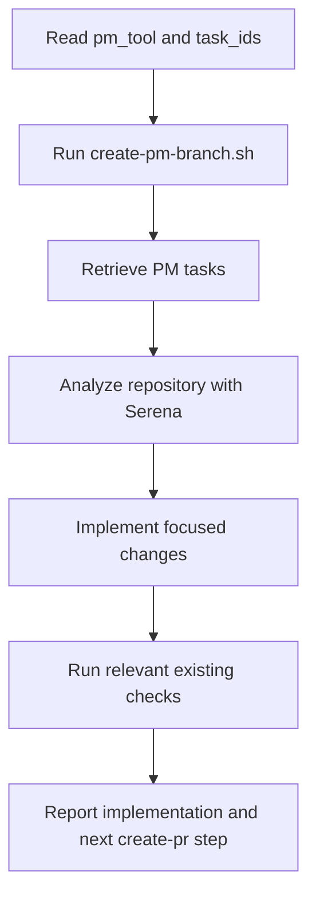

# Implement PM

## Summary

Implement PM tasks in the current checkout.

Required information can be supplied in any prompt shape.

The first action after loading this skill is always:

```bash
skills/implement-pm/scripts/create-pm-branch.sh "$pm_tool" "$task_ids"
```

That script checks out and pushes branch `$pm_tool/$task_ids`.

## Diagram



## Inputs

Required inputs:

- `$pm_tool`: PM system name, for example `github`, `jira`, `notion`, `linear`.
- `$task_ids`: exact task IDs joined exactly as they should appear in the branch name.

Do not guess missing inputs. Ask for the missing information if either value is missing.

## References

Load only what is needed:

- `references/pm-task-retrieval.md` for PM task retrieval.
- `references/implementation-git.md` for branch-script behavior and implementation Git commands.
- `references/development-rules.md` before editing and before the final diff review.

## Workflow

### First Action

Before retrieving PM tasks, analyzing code, or editing files, run:

```bash
skills/implement-pm/scripts/create-pm-branch.sh "$pm_tool" "$task_ids"
```

The branch name must be exactly:

```text
$pm_tool/$task_ids
```

### Rules

- Use Serena before implementing. If Serena is unavailable, stop instead of implementing from text search alone.
- Load and follow `references/development-rules.md`; treat missed existing-code reuse, duplicated implementation logic, dead code, unsafe boundary handling, unrelated edits, or skipped relevant checks as implementation bugs to fix before finishing.
- Reuse existing components, hooks, services, schemas, validators, DTOs, repositories, utilities, and design-system primitives before creating anything new.
- Keep business logic centralized, handlers/controllers thin, boundary validation explicit, and server-side authorization enforced.
- Preserve unrelated local work. Do not stash, reset, delete, unstage, or commit unrelated changes unless explicitly requested.
- Do not create PRs, PR descriptions, PM backlinks, review comments, or PM status updates.
- Do not add dependencies, logs, broad refactors, or new tests by default.
- During implementation and final diff review, minimize added lines relative to deleted lines. Prefer deletion, reuse, and extension over parallel code; if a small product or implementation concession would materially reduce added lines, stop and ask for user approval before taking it.
- Use the repository's existing check commands that are relevant to the touched area.

## Expected Response Format

### Response

```markdown
## Implement PM

Branch: `$pm_tool/$task_ids`

Implemented:

- <concise change>
- <concise change>

Checks:

- `<command>`: <passed|failed|not run> - <short note>

Remaining:

- <risk/blocker or "none">

Diff discipline:

- <how added lines were minimized relative to deleted lines, or concession approval needed>

Next:

<Run `create-pr`>
```
