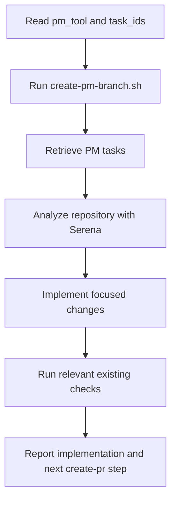

# Implement PM

## Summary

Implement PM tasks in the current checkout.

Invocation:

```text
/implement-pm $pm_tool $task_ids
```

Example:

```text
/implement-pm jira pp-12-14-15
```

The first action after loading this skill is always:

```bash
skills/implement-pm/scripts/create-pm-branch.sh "$pm_tool" "$task_ids"
```

That script checks out and pushes branch `$pm_tool/$task_ids`.

## Diagram



## Workflow

### Inputs

Required positional arguments:

- `$pm_tool`: PM system name, for example `github`, `jira`, `notion`, `linear`.
- `$task_ids`: exact task IDs joined exactly as they should appear in the branch name.

Do not guess missing arguments. Ask for the exact invocation if either value is missing.

### First Action

Before retrieving PM tasks, analyzing code, or editing files, run:

```bash
skills/implement-pm/scripts/create-pm-branch.sh "$pm_tool" "$task_ids"
```

The branch name must be exactly:

```text
$pm_tool/$task_ids
```

### References

Load only what is needed:

- `references/pm-task-retrieval.md` for PM task retrieval.
- `references/implementation-git.md` for branch-script behavior and implementation Git commands.
- `references/verification.md` for check discovery.

### Rules

- Use Serena before implementing. If Serena is unavailable, stop instead of implementing from text search alone.
- Reuse existing components, hooks, services, schemas, validators, DTOs, repositories, utilities, and design-system primitives before creating anything new.
- Keep business logic centralized, handlers/controllers thin, boundary validation explicit, and server-side authorization enforced.
- Preserve unrelated local work. Do not stash, reset, delete, unstage, or commit unrelated changes unless explicitly requested.
- Do not create PRs, PR descriptions, PM backlinks, review comments, or PM status updates.
- Do not add dependencies, logs, broad refactors, or new tests by default.
- Use the repository's existing check commands that are relevant to the touched area.

## Expected Response Format

### Final Response

```markdown
## Implement PM

Branch: `$pm_tool/$task_ids`

Implemented:

- <concise change>
- <concise change>

Checks:

- `<command>`: <passed|failed|not run> - <short note>

Remaining:

- <risk/blocker or "none">

Next:
`create-pr`
```

## Checklist

- [ ] `/implement-pm $pm_tool $task_ids` arguments parsed exactly.
- [ ] Branch script run before PM retrieval, Serena analysis, or edits.
- [ ] PM tasks retrieved with full body/comments/dependencies when available.
- [ ] Serena used to inspect existing code and reuse patterns.
- [ ] Implementation stayed within task scope.
- [ ] No PR, backlink, review, or PM status action performed.
- [ ] Relevant existing checks run or explicitly reported as not run.
- [ ] Final response points to `create-pr`.
