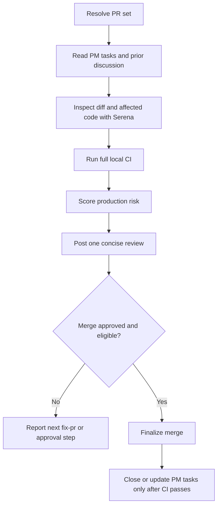

# Review PR

## Summary

Review PRs as if they will deploy immediately after merge.

The review is strict on:

- security, authentication, authorization, privacy, and secrets;
- architecture boundaries and dependency direction;
- reuse of existing business logic, validators, schemas, services, components, and design-system primitives.

Local CI passing is mandatory for `PROD READY`, merge, and PM task closure.

## Diagram



## Workflow

### Inputs

Optional:

- `PR`: PR URL, PR number, or branch.
- `repository`: repository path or owner/repo.

Default to the PR associated with the current branch. In a workspace, include matching child-repository PRs.

### References

Load only what is needed:

- `references/github-pr-review.md` for PR metadata, diffs, previous discussion, CI, review comments, and ready-for-review commands.
- `references/merge-finalization.md` only after the verdict is `PROD READY` and the user explicitly approved merge/finalization.

### Rules

- Do not implement fixes from this skill. Use `fix-pr`.
- Use Serena for changed files and directly affected code paths. If Serena is unavailable, stop.
- Read linked PM tasks before judging scope coverage.
- Read previous comments, reviews, and threads before posting new feedback.
- Run the full local CI suite for each affected repository before posting the final review.
- Do not mark `PROD READY` if local CI did not run or failed, even when failures appear out of scope.
- Do not merge or close PM tasks unless the verdict is `PROD READY`, local CI passes, required remote checks pass, and the user explicitly approved finalization.
- Do not lower the review bar because a PR is small.

## Review Standard

Hard blockers:

- exploitable security issue, broken authn/authz, secret exposure, privacy leak, unsafe user input, injection, XSS, SSRF, path traversal, or unsafe file upload;
- data loss, corruption, outage risk, unsafe migration, or broken rollback path;
- architecture boundary violation that can spread or break consumers;
- duplicated business logic, validation, permission logic, or data transformation where an existing owner exists;
- failure to reuse an existing component, schema, service, validator, hook, repository, or design-system primitive when that reuse is clearly available;
- local CI missing or failing.

Score on `/10` as a communication aid:

- Security and privacy: `0-3`
- Architecture and reuse: `0-3`
- Correctness and regressions: `0-2`
- Reliability, operations, and CI: `0-1`
- Maintainability and local style: `0-1`

Verdicts:

- `PROD READY`: `9-10`, no hard blockers, local CI passed, required remote checks passed.
- `FIX BEFORE MERGE`: targeted fixes needed or CI/checks incomplete/failing.
- `DO NOT MERGE`: security, data, outage, severe architecture, or severe correctness risk.

If the diff cannot be inspected, do not fabricate a score.

## Expected Response Format

### Final Response

```markdown
## Review PR

PR: <url>
Score: <N>/10
Verdict: <PROD READY | FIX BEFORE MERGE | DO NOT MERGE>

Findings:
- <severity> - <file:line or area> - <impact and required fix>

Checks:
- `<command>`: <passed|failed|not run> - <short note>

PR updates:
- <review/comment/body/ready/finalization action>

Finalization:
- <merge/PM closure result, approval needed, or blocker>

Next:
<exact next step, usually `fix-pr` or explicit merge approval>
```

If there are no findings, write `No blocking or major findings found.`

## Checklist

- [ ] PR set resolved from current branch or explicit input.
- [ ] Linked PM tasks and prior discussion read.
- [ ] Serena used for changed files and affected code paths.
- [ ] Governing architecture and reuse expectations identified.
- [ ] Full local CI suite run for each affected repository.
- [ ] Security, architecture, reuse, correctness, reliability, and maintainability reviewed.
- [ ] Score and verdict calculated from concrete production risk.
- [ ] One concise review posted per PR.
- [ ] Merge/finalization performed only with explicit approval and passing local CI.
