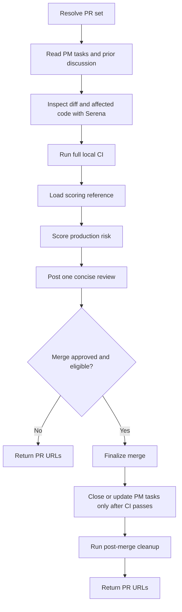

# Review PR

## Summary

Review PRs as if they will deploy immediately after merge.

Post review details on the PR. In chat, return only the reviewed PR URLs so the user can open the PRs and add comments or feedback there. Do not include a review recap, score, verdict, findings, checks, or finalization summary in the chat response.

The review is strict on:

- security, authentication, authorization, privacy, and secrets;
- declared architecture boundaries and dependency direction from governing project instruction files;
- reuse of existing business logic, validators, schemas, services, components, and design-system primitives;
- duplicated and near-duplicate code that should be standardized, including close UI components that should become one component with variants.
- avoidable net line growth, especially when deletion, reuse, or a small user-approved concession could satisfy the same scope with far fewer added lines.

Local CI passing is mandatory for `PROD READY`, merge, and PM task closure.

## Diagram



## Inputs

Optional:

- `PR`: PR URL, PR number, or branch.
- `repository`: repository path or owner/repo.

Default to the PR associated with the current branch. In a workspace, include matching child-repository PRs.

## References

Load only what is needed:

- `references/github-pr-review.md` for PR metadata, diffs, previous discussion, CI, review comments, and ready-for-review commands.
- `../feed-pm/references/architecture-rules.md` before judging architecture, reuse, duplication, task boundaries, security, frontend, backend, or design-system compliance.
- `../implement-pm/references/development-rules.md` before judging concrete implementation hygiene, local change safety, checks, and finalization readiness.
- `references/pr-scoring.md` before assigning any score or verdict. It is the scoring source of truth.
- `references/merge-finalization.md` only after the verdict is `PROD READY` and the user explicitly approved merge/finalization.

## Workflow

### Rules

- Do not implement fixes from this skill. Use `fix-pr`.
- Use Serena for changed files and directly affected code paths. If Serena is unavailable, stop.
- Load and enforce `../feed-pm/references/architecture-rules.md`; treat changed-code violations as review findings and apply `references/pr-scoring.md` for severity, score, and verdict.
- Load and enforce `../implement-pm/references/development-rules.md` for concrete implementation hygiene, change safety, and check expectations.
- Load and respect all governing global and project-specific `AGENTS.md`, `CLAUDE.md`, and `GEMINI.md` files. Treat them as authoritative repository instructions; if they conflict, surface the conflict instead of silently choosing.
- For architecture review, use the governing instruction files as the source of truth, not the code. Use code only to verify compliance, unless project-specific instruction files are missing.
- When architecture instructions name an architecture but details are missing, inconsistent, or imprecise, use Exa MCP to research best practices for that same architecture and stack before judging the PR.
- Treat duplication in changed code as a bug, including duplicated business logic, validation, permission logic, transformations, services, hooks, schemas, utilities, and near-duplicate components that should be variants.
- Review added lines relative to deleted lines. Treat avoidable large net additions as maintainability findings when a smaller reuse/deletion path or small user-approved concession would preserve the PM scope.
- Read linked PM tasks before judging scope coverage.
- Read previous comments, reviews, and threads before posting new feedback.
- Run the full local CI suite for each affected repository before posting the final review.
- Do not mark `PROD READY` if local CI did not run or failed, even when failures appear out of scope.
- Do not merge or close PM tasks unless the verdict is `PROD READY`, local CI passes, required remote checks pass, and the user explicitly approved finalization.
- After merge and approved PM task actions, run the post-merge cleanup script to switch to the PR base branch, fast-forward pull it, and delete the local merged PR branch.
- Do not lower the review bar because a PR is small.
- Use `references/pr-scoring.md` as the only scoring source of truth. If it was not loaded, do not assign a score or verdict.
- Use numeric scoring internally for consistency, but do not include the numeric score in the PR review/comment unless the user explicitly asks for it.
- Do not include the review recap, score, verdict, findings, checks, PR updates, finalization summary, or next-step recommendation in the chat response. Put review details in the PR review/comment instead.

## Expected Response Format

### Response

```markdown
## Review PR

PR URLs:

- <repo path>: <PR URL>
```
